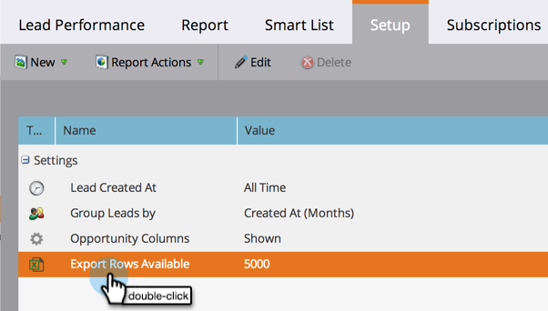

# Configura le dimensioni del rapporto {#configure-report-size}

Per impostazione predefinita, i rapporti di Marketo sono limitati a un massimo di 5.000 righe, ma puoi modificare tale limite.

1. Vai a **Attività di marketing** area.

   

1. Seleziona il rapporto dalla struttura di navigazione e fai clic sul pulsante **Configurazione** scheda .

   

1. Fare doppio clic **Esporta righe disponibili**.

   

1. Seleziona il nuovo limite.

   

   >[!TIP]
   >
   >Modificando il limite si modifica la dimensione del rapporto stesso, non solo il file Excel esportato, quindi se il rapporto richiede troppo tempo per essere generato, riduci il limite!

1. Fai clic su **Salva** per confermare il nuovo limite.

   

   Hai finito! Il rapporto rispetterà il nuovo limite.

   >[!MORELIKETHIS]
   >
   >È possibile [esportare il rapporto](/help/marketo/product-docs/reporting/basic-reporting/report-activity/export-a-report-to-excel.md) con il nuovo limite.
