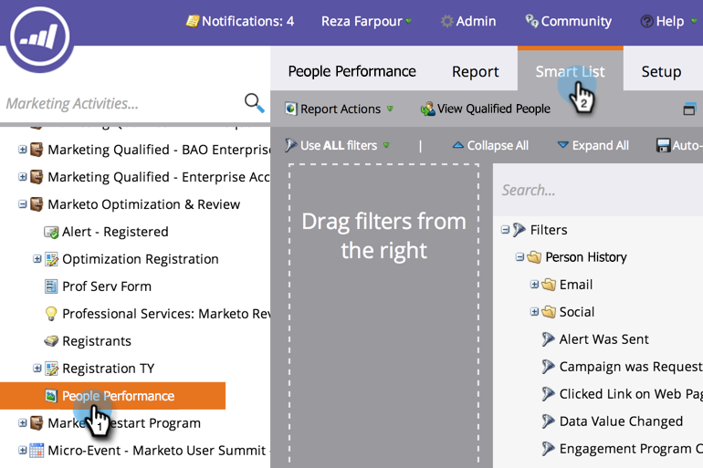

# Filtrare le persone in un rapporto con un elenco avanzato {#filter-people-in-a-report-with-a-smart-list}

Utilizza gli elenchi avanzati per filtrare i rapporti in base a attributi persona specifici.

È possibile utilizzare elenchi avanzati con i seguenti tipi di rapporti:

* [Prestazioni persone](/help/marketo/product-docs/reporting/basic-reporting/report-types/people-performance-report.md)
* [Persone per stato](/help/marketo/product-docs/reporting/basic-reporting/report-types/people-by-status-report.md)
* [Prestazioni e-mail](/help/marketo/product-docs/email-marketing/email-programs/email-program-data/email-performance-report.md)
* [Prestazioni collegamento e-mail](/help/marketo/product-docs/email-marketing/email-programs/email-program-data/email-link-performance-report.md)
* [Prestazioni del flusso di coinvolgimento](/help/marketo/product-docs/email-marketing/drip-nurturing/reports-and-notifications/engagement-stream-performance-report.md)
* [Prestazioni e-mail campagna](/help/marketo/product-docs/reporting/basic-reporting/report-types/campaign-email-performance-report.md)
* [Attività Web della società](/help/marketo/product-docs/reporting/basic-reporting/report-types/company-web-activity-report.md)
* [Attività pagina web](/help/marketo/product-docs/reporting/basic-reporting/report-types/web-page-activity-report.md)

1. Passa alla schermata **[!UICONTROL Marketing Activities]**.

   

1. Selezionare il report dalla struttura di navigazione e fare clic sulla scheda **[!UICONTROL Smart List]**.

   

1. Individuare il filtro appropriato e trascinarlo.

   

1. Configura il filtro.

   

1. Fare clic sulla scheda **[!UICONTROL Report]** per visualizzare il report filtrato.

   

   Fantastico! Ora il tuo rapporto mostra i dati solo per le persone che corrispondono all’elenco avanzato.
