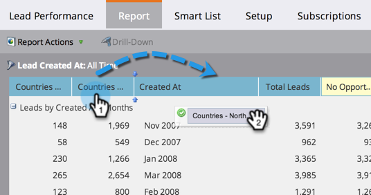

# Riordina colonne report {#reorder-report-columns}

È possibile modificare l&#39;ordine delle colonne in un rapporto.

1. Andate all&#39;area **Attività di marketing** (o **Analytics**).

   

1. Selezionate il rapporto dalla struttura di navigazione e fate clic sulla scheda **Report**.

   

1. Tenere premuto il pulsante del mouse e fare clic sulla colonna per trascinarla nella nuova posizione, quindi rilasciare il pulsante del mouse.

   

1. È tutto! Le colonne vengono ora visualizzate nel nuovo ordine.

   

   È possibile ripetere questi passaggi finché le colonne non vengono visualizzate nell&#39;ordine più adatto alle proprie esigenze.

   >[!MORELIKETHIS]
   >
   >
   >    
   >    
   >    * [Seleziona colonne rapporto](select-report-columns.md)

   >[!NOTE]
   >
   >**Tubo profondo**
   >
   >
   >Scopri tutta la potenza dell&#39;utilizzo dei report in [Basic Reporting](https://docs.marketo.com/display/docs/basic+reporting).

