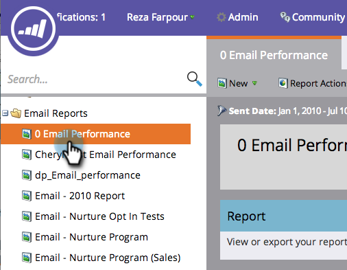

# Seleziona colonne rapporto {#select-report-columns}

Puoi scegliere quali colonne sono e non sono incluse nel rapporto.

1. Vai a **Analytics** o **Attività di marketing**).

   

1. Seleziona il rapporto.

   

1. Fai clic sul pulsante **Rapporto** , quindi fai clic su un’intestazione di colonna e seleziona **Colonne**, quindi scegli le colonne da includere.

   

   >[!MORELIKETHIS]
   >
   >[Ordina rapporto sulle colonne](/help/marketo/product-docs/reporting/basic-reporting/editing-reports/sort-report-on-columns.md)
