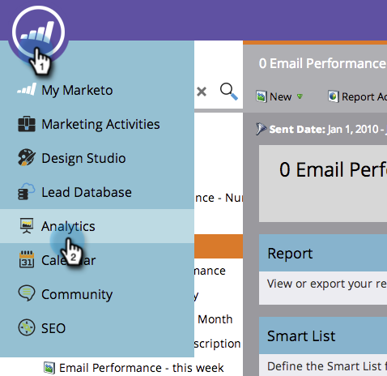

# Selezionare colonne del rapporto {#select-report-columns}

Puoi scegliere quali colonne includere e non includere nel rapporto.

1. Passare all&#39;area **[!UICONTROL Analytics]** (o **[!UICONTROL Marketing Activities]**).

   

1. Seleziona il rapporto.

   

1. Fare clic sulla scheda **[!UICONTROL Report]**, quindi su un&#39;intestazione di colonna qualsiasi e selezionare **[!UICONTROL Columns]**, quindi scegliere le colonne da includere.

   

   >[!MORELIKETHIS]
   >
   >[Ordina report per colonne](/help/marketo/product-docs/reporting/basic-reporting/editing-reports/sort-report-on-columns.md)
