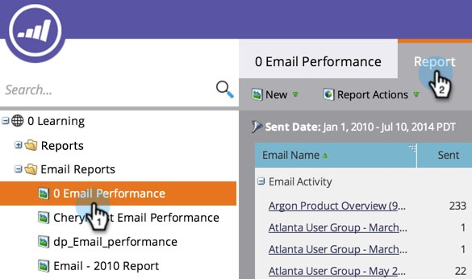

# Ordina rapporto sulle colonne {#sort-report-on-columns}

Utilizza le colonne per ordinare i dati nel rapporto e rendere le figure più importanti facili da trovare.

1. Vai a **Analytics** o **Attività di marketing**).

   

1. Seleziona il rapporto dalla struttura di navigazione e fai clic sul pulsante **Rapporto** scheda .

   

1. Fai clic sulla colonna più importante e seleziona un ordinamento.

   

1. Fantastico! Ora puoi concentrarti sui dati più interessanti del tuo report.

   

   >[!MORELIKETHIS]
   >
   >[Seleziona colonne rapporto](/help/marketo/product-docs/reporting/basic-reporting/editing-reports/select-report-columns.md)
