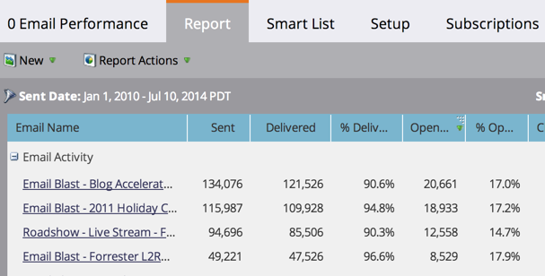

# Ordinare il rapporto in base alle colonne {#sort-report-on-columns}

Utilizza le colonne per ordinare i dati nel rapporto e individuare facilmente le figure più importanti.

1. Vai a **[!UICONTROL Analytics]** (o **[!UICONTROL Marketing Activities]**).

   

1. Selezionare il report dalla struttura di spostamento e fare clic sulla scheda **[!UICONTROL Report]**.

   

1. Fare clic sulla colonna più importante e selezionare un ordinamento.

   

1. Fantastico! Ora puoi concentrarti sui dati più interessanti nel tuo rapporto.

   

   >[!MORELIKETHIS]
   >
   >[Seleziona colonne report](/help/marketo/product-docs/reporting/basic-reporting/editing-reports/select-report-columns.md)
