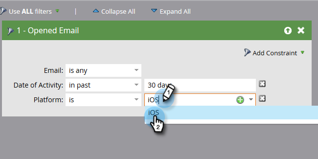
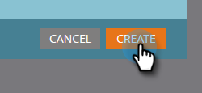

# Creare un rapporto sulle prestazioni delle persone con colonne della piattaforma mobile {#build-a-people-performance-report-with-mobile-platform-columns}

Per creare un rapporto sulle prestazioni delle persone con colonne di piattaforma mobile (iOS/Android), segui la procedura riportata di seguito.

## Creare elenchi avanzati per dispositivi mobili {#create-mobile-smart-lists}

1. Vai a **Attività di marketing**.

   

1. Scegliere un programma.

   

1. In **Nuovo**, seleziona **Nuova risorsa locale**.

   

1. Fare clic su **Elenco avanzato**.

   

1. Digitare un nome e fare clic su **Crea**.

   

1. Trova e trascina il filtro E-mail aperta nell’area di lavoro.

   

1. Imposta e-mail su **è qualsiasi**.

   

1. Fai clic su **Aggiungi vincolo** e seleziona **Piattaforma**.

   

   >[!TIP]
   >
   >In questo esempio è stato utilizzato il filtro E-mail aperta. Puoi anche utilizzare il filtro E-mail selezionata poiché presenta il vincolo Platform.

1. Imposta Platform su **iOS**.

   

   >[!NOTE]
   >
   >Almeno una persona deve aver aperto una delle tue e-mail su un dispositivo iOS affinché il suggerimento automatico di Marketo possa trovarla. Se non viene visualizzato, puoi digitarlo manualmente e salvarlo.

   Ora crea un secondo elenco avanzato per la piattaforma Android. Al termine, passa alla sezione successiva.

## Creare un rapporto sulle prestazioni delle persone {#create-a-people-performance-report}

1. In Attività di marketing, seleziona il programma che ospita gli elenchi avanzati **iOS** e **Android**.

   

1. In **Nuovo**, seleziona **Nuova risorsa locale**.

   

1. Fai clic su **Report**.

   

1. Imposta tipo su **Prestazioni persone**.

   

1. Fai clic su **Crea**.

   

   Stai andando alla grande! Passiamo ora alla sezione successiva.

## Aggiungi elenchi avanzati mobili come colonne {#add-mobile-smart-lists-as-columns}

1. Nel report appena creato, fai clic su **Configurazione**, quindi trascina **Colonne personalizzate** nell&#39;area di lavoro.

   

   >[!NOTE]
   >
   >Per impostazione predefinita, il rapporto Prestazioni persone esamina gli ultimi 7 giorni. Per modificare l’intervallo temporale, fai doppio clic su di esso.

1. Trova e seleziona gli elenchi avanzati creati in precedenza e fai clic su **Applica**.

   

1. Fai clic su **Report** per eseguire il report e visualizzare i dati.

   

   Fantastico, vero? Ben fatto!
