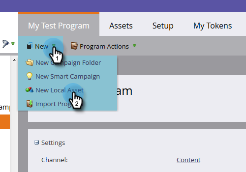
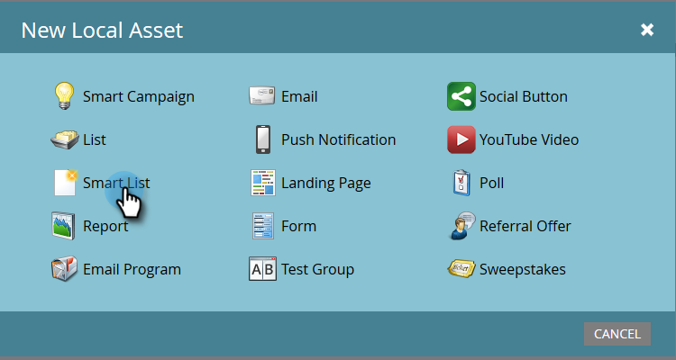

# Creare un rapporto sulle prestazioni delle persone con colonne della piattaforma mobile {#build-a-people-performance-report-with-mobile-platform-columns}

Per creare un rapporto sulle prestazioni delle persone con colonne di piattaforma mobile (iOS/Android), segui la procedura riportata di seguito.

## Creare elenchi avanzati per dispositivi mobili {#create-mobile-smart-lists}

1. Vai a **[!UICONTROL Marketing Activities]**.

   

1. Scegliere un programma.

   

1. In **[!UICONTROL New]**, selezionare **[!UICONTROL New Local Asset]**.

   

1. Fai clic su **[!UICONTROL Smart List]**.

   

1. Digitare un nome e fare clic su **[!UICONTROL Create]**.

   

1. Trovare e trascinare il filtro [!UICONTROL Opened Email] nell&#39;area di lavoro.

   

1. Impostare Email su **[!UICONTROL is any]**.

   

1. Fare clic su **[!UICONTROL Add Constraint]** e selezionare **[!UICONTROL Platform]**.

   

   >[!TIP]
   >
   >È stato utilizzato il filtro [!UICONTROL Opened Email] in questo esempio. È inoltre possibile utilizzare il filtro [!UICONTROL Clicked Email] in quanto presenta il vincolo Platform.

1. Imposta [!UICONTROL Platform] su **[!UICONTROL iOS]**.

   

   >[!NOTE]
   >
   >Almeno una persona deve aver aperto una delle tue e-mail su un dispositivo iOS affinché il suggerimento automatico di Marketo possa trovarla. Se non viene visualizzato, puoi digitarlo manualmente e salvarlo.

   Ora crea un secondo elenco avanzato per la piattaforma Android. Al termine, passa alla sezione successiva.

## Creare un rapporto sulle prestazioni delle persone {#create-a-people-performance-report}

1. In Attività di marketing selezionare il programma che contiene gli elenchi avanzati **[!UICONTROL iOS]** e **[!UICONTROL Android]**.

   

1. In **[!UICONTROL New]**, selezionare **[!UICONTROL New Local Asset]**.

   

1. Fai clic su **[!UICONTROL Report]**.

   

1. Imposta tipo su **[!UICONTROL People Performance]**.

   

1. Fai clic su **[!UICONTROL Create]**.

   

   Stai andando alla grande! Passiamo ora alla sezione successiva.

## Aggiungi elenchi avanzati mobili come colonne {#add-mobile-smart-lists-as-columns}

1. Nel report appena creato, fare clic su **[!UICONTROL Setup]**, quindi trascinare **[!UICONTROL Custom Columns]** nell&#39;area di lavoro.

   

   >[!NOTE]
   >
   >Per impostazione predefinita, il rapporto Prestazioni persone esamina gli ultimi 7 giorni. Per modificare l’intervallo temporale, fai doppio clic su di esso.

1. Trovare e selezionare gli elenchi avanzati creati in precedenza e fare clic su **[!UICONTROL Apply]**.

   

1. Fare clic su **[!UICONTROL Report]** per eseguire il report e visualizzare i dati.

   

   Fantastico, vero? Ben fatto!
