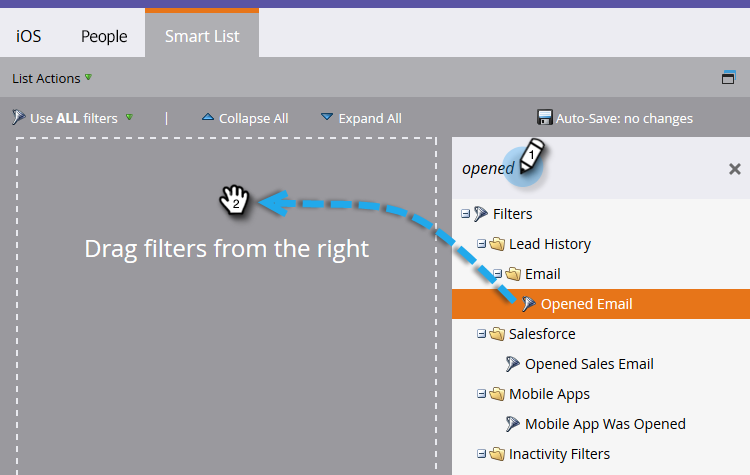

# Creare un rapporto sulle prestazioni delle persone con le colonne della piattaforma mobile {#build-a-people-performance-report-with-mobile-platform-columns}

Segui questi passaggi per creare un rapporto sulle prestazioni delle persone con colonne della piattaforma mobile (iOS/Android).

## Creare elenchi smart mobili {#create-mobile-smart-lists}

1. Vai a **Attività di marketing**.

   

1. Scegli un programma.

   

1. Sotto **Nuovo**, seleziona **Nuova risorsa locale**.

   

1. Fai clic su **Elenco avanzato**.

   

1. Digita un nome e fai clic su **Crea**.

   

1. Trova e trascina il filtro E-mail aperta nell’area di lavoro.

   

1. Imposta e-mail su **è qualsiasi**.

   

1. Fai clic su **Aggiungi vincolo** e seleziona **Piattaforma**.

   

   >[!TIP]
   >
   >In questo esempio è stato utilizzato il filtro E-mail aperta . È inoltre possibile utilizzare il filtro E-mail con clic in quanto presenta il vincolo Piattaforma .

1. Imposta piattaforma su **iOS**.

   

   >[!NOTE]
   >
   >Almeno una persona deve aver aperto una delle tue e-mail su un dispositivo iOS per consentire all’utente di Marketo di trovarlo. Se non viene visualizzato, puoi digitarlo manualmente in e salvarlo.

   Ora crea un secondo elenco smart per la piattaforma &quot;Android&quot;. Al termine, passa alla sezione successiva.

## Creare un rapporto sulle prestazioni delle persone {#create-a-people-performance-report}

1. In Attività di marketing, seleziona il programma che ospita il tuo **iOS** e **Android** elenchi smart.

   

1. Sotto **Nuovo**, seleziona **Nuova risorsa locale**.

   

1. Fai clic su **Rapporto**.

   

1. Imposta tipo su **Prestazioni delle persone**.

   

1. Fai clic su **Crea**.

   

   Stai andando alla grande! Passiamo ora alla sezione successiva.

## Aggiungi elenchi smart mobili come colonne {#add-mobile-smart-lists-as-columns}

1. Nel rapporto appena creato, fai clic su **Configurazione**, quindi trascina **Colonne personalizzate** nell&#39;area di lavoro.

   

   >[!NOTE]
   >
   >Per impostazione predefinita, il rapporto Prestazioni persone considera gli ultimi 7 giorni. Puoi modificare l’intervallo temporale facendo doppio clic su di esso.

1. Trova e seleziona gli elenchi smart creati in precedenza e fai clic su **Applica**.

   

1. Fai clic su **Rapporto** per eseguire il rapporto e visualizzare i dati.

   

   Forte, vero? Ben fatto!
