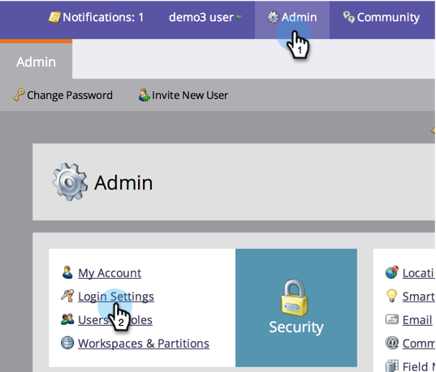

# Modificare il tempo di scadenza per gli URL nelle e-mail dei rapporti {#change-the-expiration-time-for-urls-in-report-emails}

>[!NOTE]
>
>**Autorizzazioni amministratore richieste**

I collegamenti nelle e-mail di abbonamento al report scadono dopo tre giorni. Per modificare l’ora di scadenza di questi collegamenti, segui la procedura riportata di seguito.

1. In **[!UICONTROL Admin]**, fare clic su **[!UICONTROL Login Settings]**.

   

1. Fare clic sul pulsante **[!UICONTROL Edit URL Expiration]**.

   

1. Seleziona dal menu a discesa quanti giorni prima della scadenza del collegamento. Fai clic su **[!UICONTROL Save]**.

   

   Fantastico, hai modificato le impostazioni di scadenza del collegamento e-mail.

   >[!NOTE]
   >
   >Tieni presente che questi si applicano solo ai collegamenti nei rapporti e negli avvisi, non alle e-mail di marketing.
