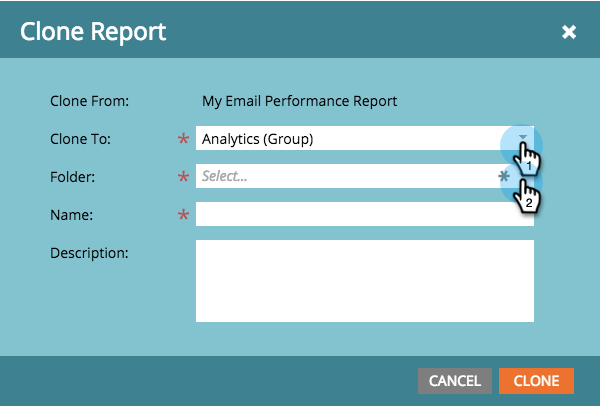
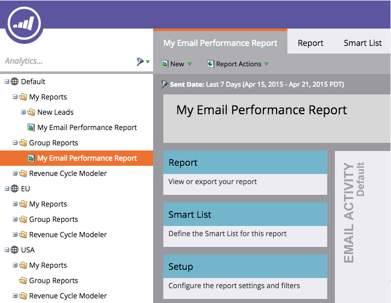

# Clonazione di un rapporto in rapporti di gruppo {#clone-a-report-to-group-reports}

Qualsiasi rapporto in **I miei rapporti **è visibile solo per te. Cosa succede se vuoi rendere il rapporto accessibile a tutti gli altri? Ecco come farlo:

1. In **Analytics** fai clic sull&#39;area desiderata [rapporto salvato](/help/marketo/product-docs/reporting/basic-reporting/creating-reports/save-a-report.md).

   

   >[!NOTE]
   >
   >In alternativa, è possibile clonare un rapporto salvato in **Report dei gruppi** trascinando il rapporto nella cartella.

1. Fai clic su **Azioni dei rapporti** e seleziona **Rapporto Clona**.

   

1. Fai clic sul pulsante **Clona in** e seleziona il gruppo. Seleziona la **Cartella**.

   

1. **Nome** il rapporto e fai clic su **Clona**.

   

   Calmo! Il rapporto verrà ora visualizzato in **Report dei gruppi**.

   
