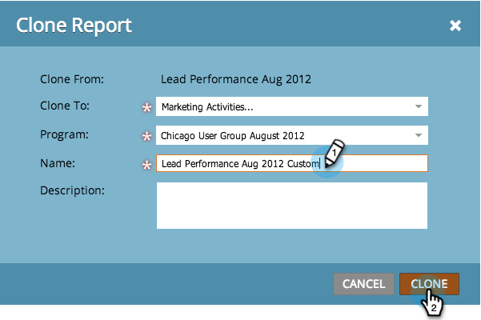

# Clona un rapporto {#clone-a-report}

Crea un duplicato del rapporto per personalizzarlo ulteriormente senza modificare l&#39;originale.

1. Vai a **Attività di marketing** o **Analytics**).

   

1. Seleziona il rapporto. Seleziona **Azioni dei rapporti** > **Clona un rapporto**.

   

   >[!TIP]
   >
   >È inoltre possibile clonare un rapporto facendo clic con il pulsante destro del mouse su di esso nella struttura.

1. Denomina il clone del rapporto.

   

   Tutto qui - sei pronto per iniziare a personalizzare il tuo clone!

   >[!MORELIKETHIS]
   >
   >[Filtrare le persone in un rapporto con un elenco avanzato](/help/marketo/product-docs/reporting/basic-reporting/editing-reports/filter-people-in-a-report-with-a-smart-list.md)
