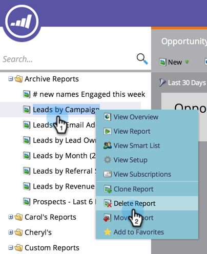

# Eliminare un rapporto {#delete-a-report}

Dopo aver iniziato a [creare i report](/help/marketo/product-docs/reporting/basic-reporting/creating-reports/create-a-report-in-a-program.md), puoi trovarne molti. Ricordati di eliminare i rapporti che non ti servono più.

1. Fare clic con il pulsante destro del mouse sul report non necessario nella struttura e selezionare **[!UICONTROL Delete Report]**.

   

1. Conferma l’intenzione di eliminare il rapporto.

   

   Il rapporto scompare dalla struttura. Vai avanti, rimuovi alcuni rapporti più vecchi ora!
