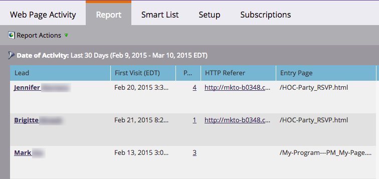

# Visualizzare persone o visitatori anonimi nei report web {#display-people-or-anonymous-visitors-in-web-reports}

>[!PREREQUISITES]
>
>[Aggiungere il codice di tracciamento Munchkin al sito Web](/help/marketo/product-docs/administration/additional-integrations/add-munchkin-tracking-code-to-your-website.md)

In [Attività pagina web](/help/marketo/product-docs/reporting/basic-reporting/report-types/web-page-activity-report.md) e  [Rapporti sull’attività web della società](/help/marketo/product-docs/reporting/basic-reporting/report-types/company-web-activity-report.md) puoi vedere [persone o visitatori anonimi](/help/marketo/product-docs/core-marketo-concepts/smart-lists-and-static-lists/managing-people-in-smart-lists/understanding-anonymous-activity-and-people.md) che visitano il tuo sito. I visitatori anonimi hanno dedotto dati, come ad esempio Metro Area.  Ecco come selezionare se nel rapporto vengono visualizzati lead noti o visitatori anonimi.

1. Nel rapporto Attività pagina Web, fai clic su **Configurazione**.

   

1. Doppio clic **Origine attività**.

   

1. Nel popup, seleziona **Lead noti** (persone) o **Visitatori anonimi** dal menu a discesa.

   

   >[!NOTE]
   >
   >L’inclusione degli ISP per i visitatori anonimi genera un rapporto più lungo, ma l’esclusione di questi fornisce una visione più chiara di dove provengono i visitatori oltre alle sorgenti standard, come Google.

1. Tutto qui. Fai clic su **Report** per tornare indietro e visualizzare il report con persone note o anonime.

   

>[!MORELIKETHIS]
>
>[Tracciamento di attività e persone anonime](/help/marketo/product-docs/reporting/basic-reporting/report-activity/tracking-anonymous-activity-and-people.md)
