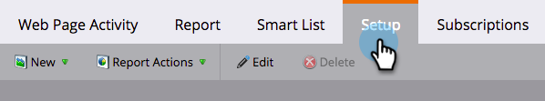

# Visualizzare persone o visitatori anonimi nei rapporti Web {#display-people-or-anonymous-visitors-in-web-reports}

>[!PREREQUISITES]
>
>[Aggiungi Munchkin Tracking Code al tuo sito Web](/help/marketo/product-docs/administration/additional-integrations/add-munchkin-tracking-code-to-your-website.md)

Nei report [Attività pagina Web](/help/marketo/product-docs/reporting/basic-reporting/report-types/web-page-activity-report.md) e [Attività Web aziendali](/help/marketo/product-docs/reporting/basic-reporting/report-types/company-web-activity-report.md) è possibile vedere [persone o visitatori anonimi](/help/marketo/product-docs/core-marketo-concepts/smart-lists-and-static-lists/managing-people-in-smart-lists/understanding-anonymous-activity-and-people.md) che visitano il sito. I visitatori anonimi hanno ricavato dati, come ad esempio Metro Area.  Di seguito viene illustrato come selezionare se il rapporto mostra i lead noti o i visitatori anonimi.

1. Nel rapporto Attività pagina Web, fare clic su **Configurazione**.

   

1. Fare doppio clic su **Origine attività**.

   

1. Nella finestra a comparsa, selezionate **Lead noti** (persone) o **Visitatori anonimi** dall&#39;elenco a discesa.

   

   >[!NOTE]
   >
   >L&#39;inclusione di ISP per i visitatori anonimi genera un rapporto più lungo, ma escludendoli fornisce una visione più chiara di dove i visitatori provengono oltre alle origini standard, come Google.

1. È tutto. Fare clic sulla scheda **Report** per tornare indietro e visualizzare il rapporto con persone conosciute o anonime.

   

>[!MORELIKETHIS]
>
>[Tracciamento delle attività e delle persone anonime](/help/marketo/product-docs/reporting/basic-reporting/report-activity/tracking-anonymous-activity-and-people.md)
