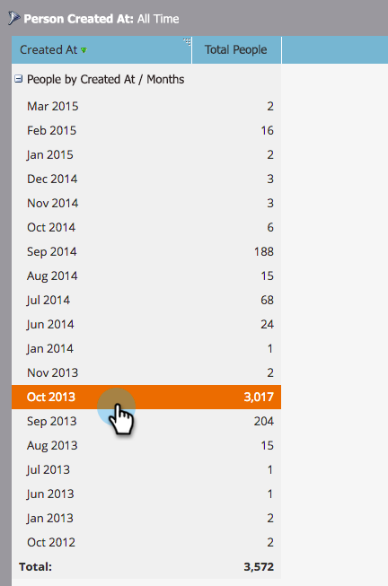

# Approfondisci in un report sulle prestazioni delle persone {#drill-down-in-a-people-performance-report}

Espandete in un report sulle prestazioni delle persone per visualizzare informazioni aggiuntive sulle persone.

1. Fare clic sulla scheda **Report** per visualizzare qualsiasi rapporto esistente.

   

1. Selezionare una riga del rapporto su cui si desidera ottenere ulteriori informazioni.

   

1. Fare clic su **Drill-Down**.

   

1. Nel menu a comparsa **Drill-Down**, selezionate l&#39;attributo a cui desiderate eseguire il drill-down. Fare clic su **Drill-Down**.

   

1. Ottimo lavoro! Il rapporto di drill-down si aprirà in una nuova scheda. Ora è possibile esaminare il nuovo rapporto.

   >[!TIP]
   >
   >Se non viene visualizzata una nuova scheda del rapporto, il browser potrebbe bloccare le finestre a comparsa. Modificate le impostazioni del browser per consentirne l&#39;utilizzo.

   

1. Per salvare i risultati (facoltativo), fate clic sull&#39;icona **Export** in basso a sinistra.

   
