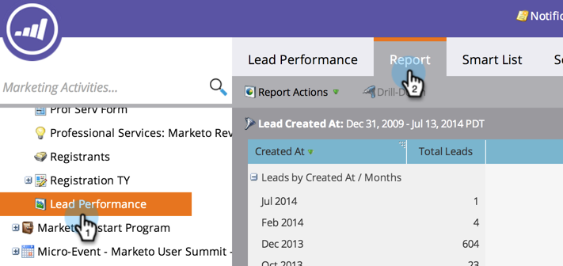

# Esporta un report in [!DNL Excel] {#export-a-report-to-excel}

È possibile esportare qualsiasi report in un file [!DNL Excel] per utilizzare i dati in altro software.

1. Passa alla schermata **[!UICONTROL Marketing Activities]**.

   

1. Selezionare il report dalla struttura di navigazione e fare clic sulla scheda **[!UICONTROL Report]**.

   

1. Fare clic sul pulsante **[!UICONTROL Export]**.

   

   Tutto qui! Il browser richiede di salvare il file [!DNL Excel] nel sistema.

   >[!MORELIKETHIS]
   >
   >Se il file scaricato è troppo grande, è possibile [modificare la dimensione del report](/help/marketo/product-docs/reporting/basic-reporting/editing-reports/configure-report-size.md).
