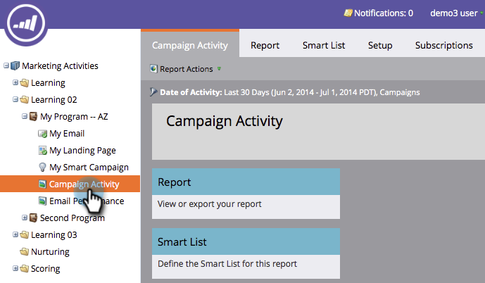

# Filtrare un rapporto di attività campagna {#filter-a-campaign-activity-report}

Metti a fuoco [Rapporto sull’attività della campagna](/help/marketo/product-docs/reporting/basic-reporting/report-types/campaign-activity-report.md)su specifiche [campagne intelligenti](/help/marketo/product-docs/core-marketo-concepts/smart-campaigns/creating-a-smart-campaign/understanding-batch-and-trigger-smart-campaigns.md).

>[!NOTE]
>
>Il filtro delle risorse nei rapporti non è supportato in modalità Satellite (l’icona &quot;apri in una nuova finestra&quot; a destra della pagina dei dettagli della risorsa).

1. Vai a **Attività di marketing** (o **Analytics**) e seleziona il rapporto sull’attività della campagna.

   

1. Fai clic su **Configurazione** e doppio clic **Campagne**.

   

1. Scegli le cartelle e le campagne intelligenti specifiche da includere nel rapporto. Clic **Applica**.

   

   >[!TIP]
   >
   >Se selezioni una cartella, il rapporto includerà tutto ciò che la cartella contiene al momento dell’esecuzione del rapporto.

1. Hai finito! Fai clic su **Report** scheda da visualizzare _solo_ le campagne intelligenti selezionate nel rapporto.

   

>[!MORELIKETHIS]
>
>[Rapporto sulle prestazioni e-mail della campagna](/help/marketo/product-docs/reporting/basic-reporting/report-types/campaign-email-performance-report.md)
