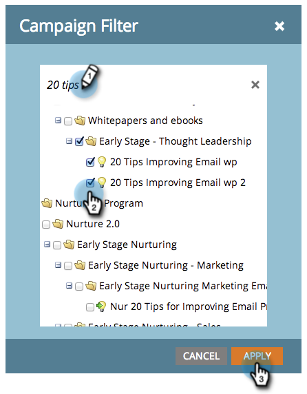

# Filtrare le risorse nei rapporti e-mail di una campagna {#filter-assets-in-a-campaign-email-reports}

Concentrare il report [Prestazioni e-mail campagna](/help/marketo/product-docs/reporting/basic-reporting/report-types/campaign-email-performance-report.md) su [campagne intelligenti](/help/marketo/product-docs/core-marketo-concepts/smart-campaigns/creating-a-smart-campaign/understanding-batch-and-trigger-smart-campaigns.md) specifiche nei programmi (&#39;risorse locali&#39;) o su quelle che sono state archiviate.

>[!NOTE]
>
>Il filtro delle risorse nei rapporti non è supportato in modalità Satellite (l’icona &quot;apri in una nuova finestra&quot; a destra della pagina dei dettagli della risorsa).

1. Vai all&#39;area **Analytics** (o **Attività di marketing**).

   

1. Seleziona il rapporto sulle prestazioni delle e-mail.

   

1. Fai clic sulla scheda **[!UICONTROL Setup]** e trascina un filtro.

   

   * **[!UICONTROL Campaigns]**: campagne intelligenti attive nel tuo account Marketo.
   * **[!UICONTROL Archived Campaigns]**: campagne intelligenti inattive, ritirate.

1. Scegli le cartelle e le campagne intelligenti specifiche da includere nel rapporto.

   

   >[!TIP]
   >
   >Se selezioni una cartella, il rapporto includerà tutto ciò che la cartella contiene al momento dell’esecuzione del rapporto.

1. Hai finito! Fare clic sulla scheda **[!UICONTROL Report]** per visualizzare il report filtrato.

   

   >[!MORELIKETHIS]
   >
   >[Rapporto prestazioni e-mail campagna](/help/marketo/product-docs/reporting/basic-reporting/report-types/campaign-email-performance-report.md)
   >[Filtrare Assets in un report e-mail](/help/marketo/product-docs/reporting/basic-reporting/report-activity/filter-assets-in-an-email-report.md)
