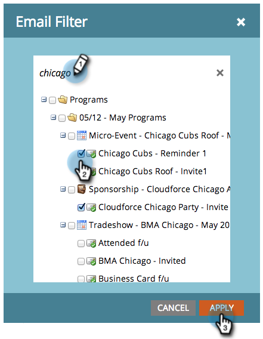

# Filtrare le risorse in un report e-mail {#filter-assets-in-an-email-report}

Concentrare il report [Email Performance](../../../../product-docs/email-marketing/email-programs/email-program-data/email-performance-report.md) o [Email Link Performance](../../../../product-docs/email-marketing/email-programs/email-program-data/email-link-performance-report.md) sulle e-mail nei programmi (risorse locali), su quelle in Design Studio (risorse globali) o su quelle archiviate.

1. Andate all&#39;area **Analytics** (o **Marketing Activities**).

   

1. Selezionate il rapporto e-mail.

   

1. Fare clic sulla scheda **Setup** e trascinare su un filtro.

   

   * **E-mail** di Design Studio: Risorse globali, gestite in Design Studio.
   * **E-mail** attività di marketing: Risorse locali nei programmi nella scheda Attività di marketing.
   * **E-mail** archiviate: E-mail inattive e ritirate.

1. Scegliete le cartelle e le e-mail specifiche da includere nel rapporto.

   

   >[!TIP]
   >
   >Se selezionate una cartella, il rapporto includerà tutto ciò che contiene al momento dell&#39;esecuzione del rapporto.

1. Hai finito! Fare clic sulla scheda **Report** per visualizzare il rapporto filtrato.

   

>[!MORELIKETHIS]
>
>* [Filtrare le risorse in un report e-mail campagna](filter-assets-in-a-campaign-email-reports.md)

>

>[!NOTE]
>
>**Tubo profondo**
>
>Scopri tutte le informazioni sui report in [Basic Reporting](https://docs.marketo.com/display/docs/basic+reporting).

