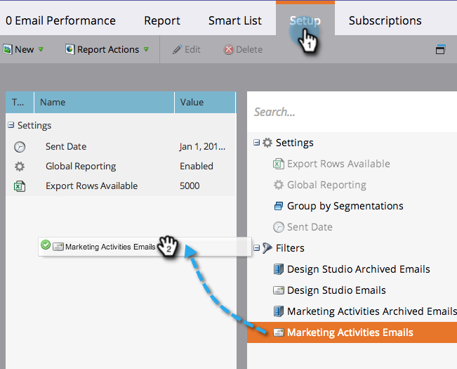

# Filtrare le risorse in un rapporto e-mail {#filter-assets-in-an-email-report}

Concentrare il report [Prestazioni e-mail](/help/marketo/product-docs/email-marketing/email-programs/email-program-data/email-performance-report.md) o [Prestazioni collegamenti e-mail](/help/marketo/product-docs/email-marketing/email-programs/email-program-data/email-link-performance-report.md) sulle e-mail nei programmi (&#39;risorse locali&#39;), su quelle in Design Studio (&#39;risorse globali&#39;) o su quelle che sono state archiviate.

>[!NOTE]
>
>Il filtro delle risorse nei rapporti non è supportato in modalità Satellite (l’icona &quot;apri in una nuova finestra&quot; a destra della pagina dei dettagli della risorsa).

1. Vai all&#39;area **Analytics** (o **Attività di marketing**).

   

1. Seleziona il rapporto e-mail.

   

1. Fai clic sulla scheda **[!UICONTROL Setup]** e trascina un filtro.

   

   * **[!UICONTROL Design Studio Emails]**: risorse globali, gestite in Design Studio.
   * **[!UICONTROL Marketing Activities Emails]**: risorse locali nei programmi nella scheda Attività di marketing.
   * **E-mail archiviate**: e-mail inattive, ritirate.

1. Scegli le cartelle e le e-mail specifiche da includere nel rapporto.

   

   >[!TIP]
   >
   >Se selezioni una cartella, il rapporto includerà tutto ciò che la cartella contiene al momento dell’esecuzione del rapporto.

1. Hai finito! Fare clic sulla scheda **[!UICONTROL Report]** per visualizzare il report filtrato.

   

>[!MORELIKETHIS]
>
>[Filtrare i report e-mail di Assets in una campagna](/help/marketo/product-docs/reporting/basic-reporting/report-activity/filter-assets-in-a-campaign-email-reports.md)
