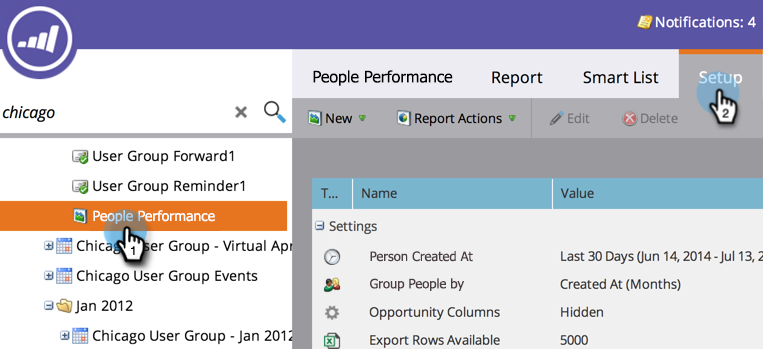

# Raggruppare rapporti persona per attributo {#group-person-reports-by-attribute}

È possibile raggruppare i rapporti sulle persone in base a qualsiasi attributo di persona o società.

1. Passare all&#39;area **[!UICONTROL Marketing Activities]** (o **[!UICONTROL Analytics]**).

   

1. Selezionare il report della persona dalla struttura di navigazione e fare clic sulla scheda **[!UICONTROL Setup]**.

   

1. Fare doppio clic su **[!UICONTROL Group People by]**.

   

   >[!NOTE]
   >
   >È inoltre possibile [raggruppare i report delle persone per segmento](/help/marketo/product-docs/personalization/segmentation-and-snippets/segmentation/group-person-reports-by-segment.md).

   Nella finestra di dialogo [!UICONTROL Group People by] selezionare l&#39;attributo persona o società da utilizzare per il raggruppamento.

   

   >[!TIP]
   >
   >Se scegli un attributo con un valore numerico, ad esempio _[!UICONTROL Created At]_o_[!UICONTROL Annual Revenue]_, seleziona le metriche dal menu a discesa **[!UICONTROL Units]** a destra.

   Fare clic sulla scheda **[!UICONTROL Report]** per raggruppare il report di conseguenza.

   

   >[!MORELIKETHIS]
   >
   >[Aggiungere colonne personalizzate a un report persona](/help/marketo/product-docs/reporting/basic-reporting/editing-reports/add-custom-columns-to-a-person-report.md)
