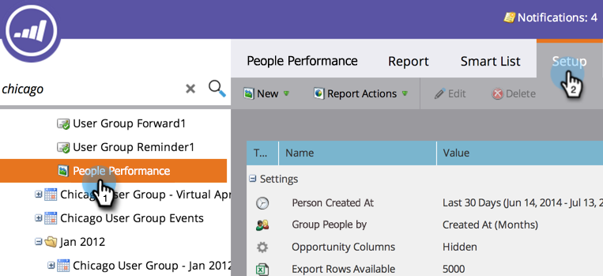

# Rapporti sulla persona del gruppo per attributo {#group-person-reports-by-attribute}

Potete raggruppare i rapporti sulle persone in base a qualsiasi attributo di persona o società.

1. Andate all&#39;area **Attività di marketing** (o **Analytics**).

   

1. Selezionate il rapporto sulla persona nella struttura di navigazione e fate clic sulla scheda **Setup**.

   

1. Fare doppio clic su **Raggruppa persone per**.

   

   >[!NOTE]
   >
   >È inoltre possibile [raggruppare i rapporti personali per segmento](/help/marketo/product-docs/personalization/segmentation-and-snippets/segmentation/group-person-reports-by-segment.md).

   Nella finestra di dialogo Raggruppa persone per, selezionate l’attributo persona o società da usare per il raggruppamento.

   

   >[!TIP]
   >
   >Se scegliete un attributo con un valore numerico, ad esempio _Creato a_ o _Entrate annuali_, selezionate le metriche dal menu a discesa **Unità** a destra.

   È tutto! Fai clic sulla scheda Rapporto per visualizzare il rapporto raggruppato di conseguenza.

   

   >[!MORELIKETHIS]
   >
   >[Aggiunta di colonne personalizzate a un report di persona](/help/marketo/product-docs/reporting/basic-reporting/editing-reports/add-custom-columns-to-a-person-report.md)
