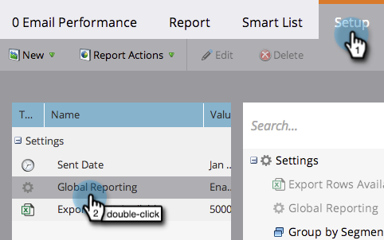
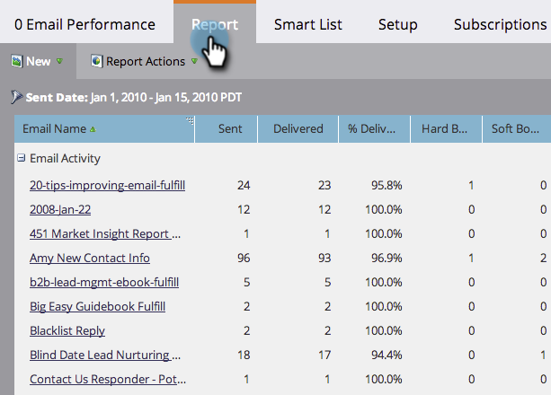

# E-mail report, prestazioni della campagna nelle aree di lavoro {#report-email-campaign-performance-across-workspaces}

Attivate Global Reporting per includere i dati provenienti da tutte le aree di lavoro di Marketing [aree di lavoro](/help/marketo/product-docs/administration/workspaces-and-person-partitions/create-a-new-workspace.md) nei rapporti [Prestazioni e-mail](/help/marketo/product-docs/email-marketing/email-programs/email-program-data/email-performance-report.md), [Prestazioni collegamento e-mail](/help/marketo/product-docs/email-marketing/email-programs/email-program-data/email-link-performance-report.md) e [Attività campagna](/help/marketo/product-docs/reporting/basic-reporting/report-types/campaign-activity-report.md).

1. Andate all&#39;area **Analytics** (o **Marketing Activities**).

   

1. Selezionate il rapporto.

   

1. Fare clic sulla scheda **Setup** e fare doppio clic su **Global Reporting**.

   

1. Selezionare **Enabled**.

   

1. È tutto! Fare clic sulla scheda **Report** per visualizzare i dati di tutte le aree di lavoro.

   

   >[!MORELIKETHIS]
   >
   >[Filtrare le risorse in un rapporto e-mail](/help/marketo/product-docs/reporting/basic-reporting/report-activity/filter-assets-in-an-email-report.md)
