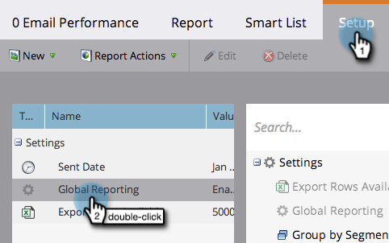

# E-mail rapporti, prestazioni campagna in più aree di lavoro {#report-email-campaign-performance-across-workspaces}

Attiva la funzione di reporting globale per includere i dati di tutte le [aree di lavoro](/help/marketo/product-docs/administration/workspaces-and-person-partitions/create-a-new-workspace.md) di Marketo nei tuoi [report Prestazioni e-mail](/help/marketo/product-docs/email-marketing/email-programs/email-program-data/email-performance-report.md) e Prestazioni [Collegamento e-mail](/help/marketo/product-docs/email-marketing/email-programs/email-program-data/email-link-performance-report.md).

1. Passare all&#39;area **[!UICONTROL Analytics]** (o **[!UICONTROL Marketing Activities]**).

   

1. Seleziona il rapporto.

   

1. Fare clic sulla scheda **[!UICONTROL Setup]** e fare doppio clic su **[!UICONTROL Global Reporting]**.

   

1. Seleziona **[!UICONTROL Enabled]**.

   

1. Tutto qui! Fare clic sulla scheda **[!UICONTROL Report]** per visualizzare i dati di tutte le aree di lavoro.

   

   >[!MORELIKETHIS]
   >
   >[Filtrare Assets in un report e-mail](/help/marketo/product-docs/reporting/basic-reporting/report-activity/filter-assets-in-an-email-report.md)
