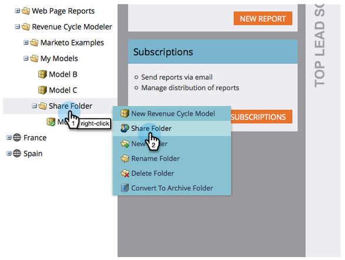

# Condividere un modello tra aree di lavoro {#share-a-model-across-workspaces}

Marketo consente di condividere un modello o più modelli tra le diverse aree di lavoro. Ecco come.

1. Vai a **Analytics** sezione .

   

1. Fai clic con il pulsante destro del mouse **Modelli personali** e fai clic su **Nuova cartella**.

   

1. Denomina la cartella.

   

1. Trascina i modelli da condividere nel **Condividi cartella**.

   

1. Fai clic con il pulsante destro del mouse sulla cartella e fai clic su **Condividi cartella**.

   

   >[!NOTE]
   >
   >La condivisione di un modello con un’altra area di lavoro consente agli utenti di eseguire rapporti basati sul modello.

1. Selezionare le aree di lavoro con cui si desidera condividere la cartella e fare clic su **Salva**.

   

È così facile! Ora le persone provenienti da altre aree di lavoro possono spostarsi all&#39;interno del modello condiviso.
