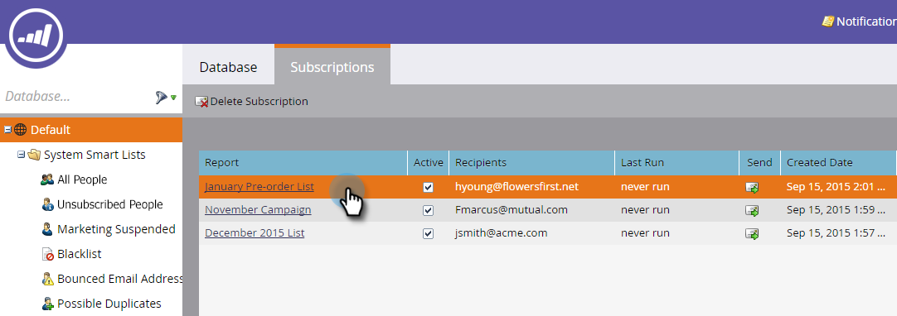
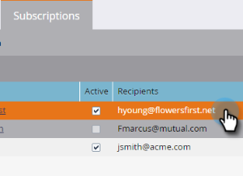
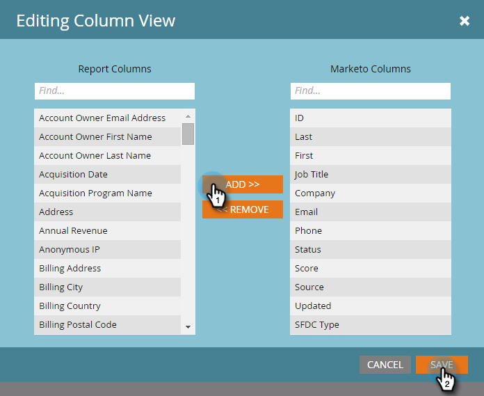

# Modificare un abbonamento a un elenco avanzato {#edit-a-smart-list-subscription}

Puoi modificare queste colonne direttamente nella scheda Sottoscrizioni, che viene visualizzata in Attività di marketing o Database:

* [!UICONTROL Recipients]
* [!UICONTROL Frequency]
* [!UICONTROL Columns]
* [!UICONTROL End Delivery]
* [!UICONTROL Format]

1. Seleziona **[!UICONTROL Database]** (lo stiamo utilizzando in questo esempio, ma le attività di marketing funzionano esattamente nello stesso modo).

   

1. Seleziona la sottoscrizione da modificare.

   

1. Fare clic nella colonna **[!UICONTROL Recipients]** per aprirla in modo da poter immettere altri indirizzi di posta elettronica (separarli con una virgola).

   

1. Fare clic sulla colonna **[!UICONTROL Frequency]** per scegliere o modificare l&#39;impostazione.

   

1. Aprire la colonna **[!UICONTROL Columns]** e utilizzare il selettore per aggiungere o rimuovere colonne dal report. Colonne report contiene tutte le colonne disponibili e Colonne Marketo mostra solo quelle selezionate per la visualizzazione nel report. Fai clic su **[!UICONTROL Save]**.

   

   >[!NOTE]
   >
   >Le colonne in Colonne di Marketo sono le colonne del rapporto, non quelle utilizzate nella scheda del rapporto Sottoscrizioni.

1. Fare clic sulla colonna **[!UICONTROL End Date]** per modificare la data di fine. Selezionare **[!UICONTROL Never]** o **[!UICONTROL Date]**. Per una data, inseritela o sceglietela dal calendario. Fai clic su **[!UICONTROL Approve]**.

   

1. L&#39;ultimo tassello del puzzle è il formato. Fare clic sulla colonna **[!UICONTROL Format]** e selezionare quella desiderata. Il valore predefinito è CSV.

   
