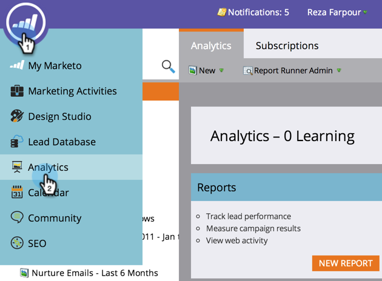

# Gestisci sottoscrizioni report {#manage-report-subscriptions}

Configurare ed eliminare le sottoscrizioni dei rapporti.

1. Andate all&#39;area **Analytics**.

   

1. Fare clic sulla scheda **Iscrizioni**.

   

   In questa pagina vengono visualizzate le iscrizioni a tutti i rapporti dell&#39;account, raggruppati per [tipo di rapporto](/help/marketo/product-docs/reporting/basic-reporting/report-types/report-type-overview.md). Sono incluse le sottoscrizioni [ai report di base](/help/marketo/product-docs/reporting/basic-reporting/report-subscriptions/subscribe-to-a-basic-report.md) e ai report Esplora ciclo di ricavi.

   >[!TIP]
   >
   >Puoi anche gestire le iscrizioni a un singolo rapporto in **Attività marketing**. Selezionate il rapporto e fate clic sulla scheda **Iscrizioni**.

   Per modificare la frequenza di invio di un rapporto tramite e-mail, fai clic sul campo Frequenza e seleziona una nuova opzione dal menu a discesa.

   

1. Per modificare gli indirizzi e-mail in un&#39;iscrizione, fate clic sul campo **Destinatari e-mail** e modificate gli indirizzi e-mail.

   

   >[!TIP]
   >
   >* Usate virgole tra gli indirizzi e-mail.
   >* Per salvare le modifiche, fare clic in un&#39;area _all&#39;esterno_ dell&#39;elenco delle sottoscrizioni.

   È inoltre possibile:

   * Fare clic sul pulsante **Visualizza** per aprire un rapporto.
   * Deselezionate la casella di controllo **Active** per disattivare l&#39;iscrizione.
   * Fate clic sul campo **Riepilogo** e modificate il numero di righe di anteprima visualizzate nell&#39;e-mail.
   * Deselezionate la casella di controllo **Excel** per inviare i riepiloghi dei rapporti senza l&#39;allegato del foglio di calcolo.
   * Fare clic sul pulsante **Invia** per inviare immediatamente l&#39;e-mail del rapporto.

1. Per eliminare completamente una sottoscrizione, selezionare la riga e fare clic su **Elimina iscrizione**.

   

1. Confermate l&#39;intenzione di eliminare l&#39;iscrizione.

   

   >[!MORELIKETHIS]
   >
   >* [Iscriviti a un report di base](/help/marketo/product-docs/reporting/basic-reporting/report-subscriptions/subscribe-to-a-basic-report.md)
   >* [Iscriviti a un report di Esplora entrate](/help/marketo/product-docs/reporting/revenue-cycle-analytics/revenue-explorer/subscribe-to-a-revenue-explorer-report.md)

