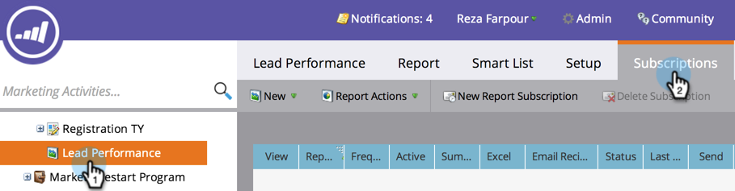

# Abbonati a un rapporto di base {#subscribe-to-a-basic-report}

Per ricevere aggiornamenti automatici di un report di base o per condividerli, è possibile sottoscrivere qualsiasi indirizzo e-mail a un report esistente.

>[!NOTE]
>
>Per le sottoscrizioni ai report di Revenue Cycle Explorer, vedere [Abbonarsi a un report di Revenue Explorer](/help/marketo/product-docs/reporting/revenue-cycle-analytics/revenue-explorer/subscribe-to-a-revenue-explorer-report.md).

1. Passa alla schermata **[!UICONTROL Marketing Activities]**.

   

1. Selezionare il report dalla struttura di navigazione e fare clic sulla scheda **[!UICONTROL Subscriptions]**.

   

   >[!NOTE]
   >
   >È inoltre possibile sottoscrivere i report dalla scheda **[!UICONTROL Analytics]**.

1. Fai clic su **[!UICONTROL New Report Subscription]**.

   

1. Inserisci gli indirizzi e-mail e imposta la frequenza delle e-mail del rapporto.

   

   >[!NOTE]
   >
   >Chiunque può annullare l’abbonamento al report nell’e-mail che riceve.

   

   >[!MORELIKETHIS]
   >
   >Scopri come [gestire tutte le sottoscrizioni ai report](/help/marketo/product-docs/reporting/basic-reporting/report-subscriptions/manage-report-subscriptions.md) in un&#39;unica posizione.
