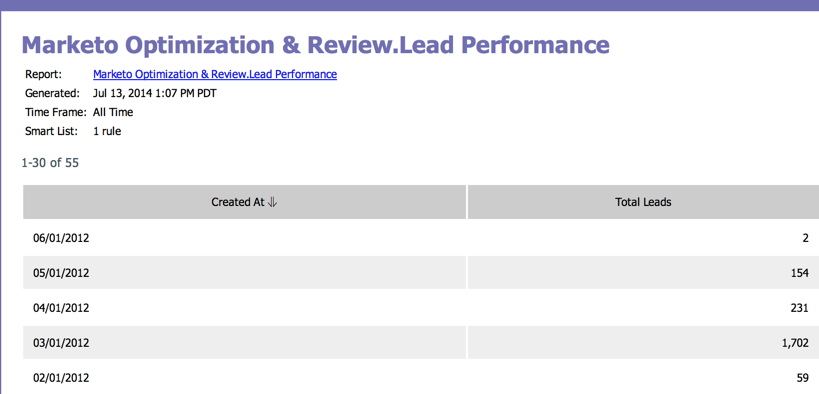

# Iscriviti a un report di base {#subscribe-to-a-basic-report}

Per ricevere gli aggiornamenti automatici di un rapporto di base, o per condividerli, potete sottoscrivere qualsiasi indirizzo e-mail a un rapporto esistente.

>[!NOTE]
>
>Per le sottoscrizioni di report di Esplora ricavi, vedere [Iscrizione a un report di Esplora ricavi](/help/marketo/product-docs/reporting/revenue-cycle-analytics/revenue-explorer/subscribe-to-a-revenue-explorer-report.md).

1. Andate all&#39;area **Attività di marketing**.

   

1. Selezionate il rapporto dalla struttura di navigazione e fate clic sulla scheda **Iscrizioni**.

   

   >[!NOTE]
   >
   >Potete inoltre iscrivervi ai rapporti dalla scheda **Analytics**.

1. Fare clic su **Nuova sottoscrizione report**.

   

1. Inserite gli indirizzi e-mail e impostate la frequenza delle e-mail del rapporto.

   

   >[!NOTE]
   >
   >Chiunque può annullare l’iscrizione nel messaggio e-mail ricevuto.

   È tutto! Controlla la tua inbox!

   

   >[!MORELIKETHIS]
   >
   >Scopri come [gestire tutte le iscrizioni per report](/help/marketo/product-docs/reporting/basic-reporting/report-subscriptions/manage-report-subscriptions.md) in un&#39;unica posizione.
