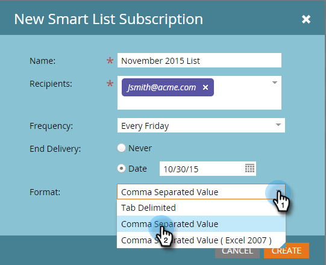

# Iscriviti a un elenco avanzato {#subscribe-to-a-smart-list}

Iscriversi a elenchi smart è un ottimo modo per tenere traccia delle persone, con i rapporti inviati direttamente alla tua casella in entrata.

Puoi creare una sottoscrizione a un elenco smart in due posizioni distinte:

* Attività di marketing
* Database

Gli abbonamenti utilizzano l’elenco completo delle persone al momento dell’esecuzione dell’abbonamento.

Le sottoscrizioni sono live in cui si trova l&#39;elenco smart, in Attività di marketing o Database.

È possibile creare più abbonamenti dallo stesso smart list.

Le sottoscrizioni sono specifiche per l&#39;area di lavoro. Ad esempio, questo elenco di sottoscrizioni si trova in un’area di lavoro diversa da quelle mostrate nel resto dell’articolo:

>[!NOTE]
>
>Puoi avere un massimo di 100 abbonamenti e un massimo di 100.000 persone per abbonamento, su più aree di lavoro, per istanza di Marketo. Se l’elenco avanzato contiene più di 100.000 nomi, Marketo eseguirà l’abbonamento per i primi 100.000.

## Creare una sottoscrizione a un elenco avanzato {#create-a-smart-list-subscription}

1. Vai a **Database** o **Attività di marketing**.

   

1. Selezionare l’elenco smart per il quale si desidera creare un abbonamento. Fai clic su **Azioni elenco** e seleziona **Nuova sottoscrizione a elenchi avanzati**.

   

1. Assegna un abbonamento a **Nome**, quindi seleziona o immetti gli indirizzi e-mail del **Destinatari**.

   

1. Fai clic sul pulsante **Frequenza** e selezionare una frequenza.

   

1. Imposta la **Fine consegna** data. È possibile selezionare **Mai** o una data del calendario.

   

1. Fai clic su **Formato** e scegliere dall&#39;elenco.

   

1. Fai clic su **Crea**.

   

1. La nuova sottoscrizione all’elenco smart viene visualizzata nella parte superiore dell’elenco nella scheda Sottoscrizioni. Fai clic su **Invia** se desideri inviare ora e non attendere la consegna e-mail pianificata.

   

1. È consigliabile deselezionare la casella di controllo Attivo per disattivare l’abbonamento a un elenco smart se non è presente alcun abbonamento.

   

   Era facile, vero?

## Messaggio e-mail {#email-message}

I destinatari riceveranno un’e-mail con un’opzione per scaricare il rapporto, nonché un collegamento diretto all’elenco all’interno dell’istanza di Marketo. Il collegamento per il download scade tra quattro giorni.

>[!NOTE]
>
>Se la [Amministrazione di un abbonamento sicuro](/help/marketo/product-docs/reporting/basic-reporting/report-subscriptions/secure-the-subscription-admin-setting.md) è impostato su **Sì**, solo le persone con accesso all’istanza Marketo potranno scaricare il rapporto.

Se un rapporto contiene 0 persone, i destinatari riceveranno comunque un’e-mail. Tuttavia, l&#39;e-mail dichiara semplicemente che non ci sono persone da segnalare.

>[!NOTE]
>
>Quando modifichi un filtro per elenchi avanzati su cui hai basato una sottoscrizione, aggiorna anche il rapporto.

L’e-mail fornisce inoltre informazioni aggiuntive sui filtri utilizzati per creare l’elenco.

## Eliminare una sottoscrizione {#delete-a-subscription}

Per eliminare un abbonamento, selezionalo nella scheda Abbonamenti e fai clic su Elimina abbonamento .

>[!MORELIKETHIS]
>
>* [Modificare una sottoscrizione a un elenco avanzato](/help/marketo/product-docs/reporting/basic-reporting/report-subscriptions/edit-a-smart-list-subscription.md)
>* [Proteggere l’impostazione di amministrazione della sottoscrizione](/help/marketo/product-docs/reporting/basic-reporting/report-subscriptions/secure-the-subscription-admin-setting.md)

