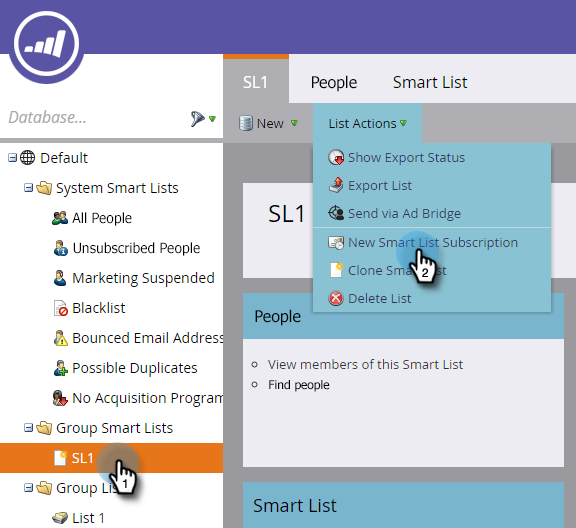

# Abbonati a un elenco avanzato {#subscribe-to-a-smart-list}

L’iscrizione a elenchi avanzati è un ottimo modo per tenere traccia delle persone, con i rapporti inviati direttamente nella tua casella in entrata.

Puoi creare una sottoscrizione a un elenco avanzato in due posizioni separate:

* [!UICONTROL Marketing Activities]
* [!UICONTROL Database]

Gli abbonamenti utilizzano l’elenco completo delle persone al momento in cui vengono eseguiti.

Gli abbonamenti vivono dove si trova il tuo elenco avanzato, in [!UICONTROL Marketing Activities] o [!UICONTROL Database].

È possibile creare più sottoscrizioni dallo stesso elenco avanzato.

Le sottoscrizioni sono specifiche dell’area di lavoro. Ad esempio, questo elenco di abbonamenti si trova in un’area di lavoro diversa da quelle mostrate nel resto di questo articolo:

>[!NOTE]
>
>Puoi scegliere un massimo di 100 abbonamenti e 100.000 persone per abbonamento, nelle diverse aree di lavoro e per istanza di Marketo. Se l&#39;elenco smart contiene più di 100.000 nomi, Marketo eseguirà l&#39;abbonamento per i primi 100.000.

## Creare una sottoscrizione a un elenco avanzato {#create-a-smart-list-subscription}

1. Passare a **[!UICONTROL Database]** o **[!UICONTROL Marketing Activities]**.

   

1. Seleziona l’elenco avanzato per il quale desideri creare una sottoscrizione. Fare clic su **[!UICONTROL List Actions]** e selezionare **[!UICONTROL New Smart List Subscription]**.

   

1. Assegna un **[!UICONTROL Name]** al tuo abbonamento, quindi seleziona o immetti gli indirizzi e-mail di **[!UICONTROL Recipients]**.

   

1. Fare clic sull&#39;elenco **[!UICONTROL Frequency]** e selezionare una frequenza.

   

1. Imposta la data **[!UICONTROL End Delivery]**. È possibile selezionare **[!UICONTROL Never]** o una data calendario.

   

1. Fare clic su **[!UICONTROL Format]** e scegliere dall&#39;elenco.

   

1. Fai clic su **[!UICONTROL Create]**.

   

1. Il nuovo abbonamento all’elenco avanzato viene visualizzato nella parte superiore dell’elenco nella scheda Abbonamenti. Fare clic su **[!UICONTROL Send]** se si desidera inviare ora e non attendere la consegna dell&#39;e-mail pianificata.

   

1. È consigliabile deselezionare la casella di controllo **[!UICONTROL Active]** per disattivare una sottoscrizione a un elenco avanzato se non vi è alcuna sottoscrizione.

   

   È stato facile, vero?

## Messaggio e-mail {#email-message}

I destinatari riceveranno un’e-mail con l’opzione di download del rapporto e un collegamento diretto all’elenco all’interno dell’istanza di Marketo. Il link per il download scade tra quattro giorni.

>[!NOTE]
>
>Se l&#39;impostazione [Amministratore sottoscrizione sicura](/help/marketo/product-docs/reporting/basic-reporting/report-subscriptions/secure-the-subscription-admin-setting.md) è impostata su **[!UICONTROL Yes]**, solo gli utenti con accesso all&#39;istanza di Marketo saranno in grado di scaricare il report.

Se un rapporto contiene 0 persone, i destinatari riceveranno comunque un’e-mail. Tuttavia, l’e-mail si limita a indicare che non ci sono persone da segnalare.

>[!NOTE]
>
>Quando modifichi un filtro per elenchi avanzati su cui hai basato una sottoscrizione, aggiorna anche il rapporto.

L’e-mail fornisce anche informazioni aggiuntive sui filtri utilizzati per creare l’elenco.

## Eliminare una sottoscrizione {#delete-a-subscription}

Per eliminare una sottoscrizione, selezionarla nella scheda Sottoscrizioni e fare clic su **[!UICONTROL Delete Subscription]**.

>[!MORELIKETHIS]
>
>* [Modifica sottoscrizione a elenco avanzato](/help/marketo/product-docs/reporting/basic-reporting/report-subscriptions/edit-a-smart-list-subscription.md)
>* [Proteggere le impostazioni di amministrazione della sottoscrizione](/help/marketo/product-docs/reporting/basic-reporting/report-subscriptions/secure-the-subscription-admin-setting.md)
