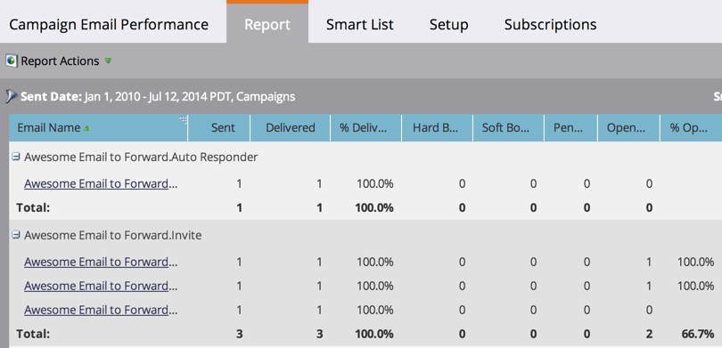

# Rapporto prestazioni e-mail campagna {#campaign-email-performance-report}

Per visualizzare le statistiche delle prestazioni delle e-mail raggruppate per [Smart Campaign](/help/marketo/product-docs/core-marketo-concepts/smart-campaigns/creating-a-smart-campaign/understanding-batch-and-trigger-smart-campaigns.md), esegui un rapporto sulle prestazioni e-mail di Campaign.

>[!NOTE]
>
>È possibile creare un rapporto sulle prestazioni e-mail di una campagna solo come risorsa locale in un programma Attività di marketing. Non è disponibile nella sezione Analytics.

1. [Crea un report](/help/marketo/product-docs/reporting/basic-reporting/creating-reports/create-a-report-in-a-program.md) e seleziona il **[!UICONTROL Campaign Email Performance]** [tipo di report](/help/marketo/product-docs/reporting/basic-reporting/report-types/report-type-overview.md).

1. [Impostare l&#39;intervallo di tempo del report](/help/marketo/product-docs/reporting/basic-reporting/editing-reports/change-a-report-time-frame.md) e fare clic sulla scheda **[!UICONTROL Report]**.

1. Ora esplora il rapporto per visualizzare le prestazioni di ogni e-mail nelle campagne.

   

   >[!TIP]
   >
   >Fai clic sul nome di un’e-mail per aprirla in Anteprima e-mail.

   [Le colonne che puoi selezionare](/help/marketo/product-docs/reporting/basic-reporting/editing-reports/select-report-columns.md) per un report sulle prestazioni e-mail della campagna includono:

   | Colonna | Descrizione |
   |---|---|
   | [!UICONTROL Hard Bounced] | L’e-mail è stata rifiutata a causa di una condizione permanente, ad esempio un indirizzo e-mail inesistente. |
   | [!UICONTROL Soft Bounced] | L’e-mail è stata rifiutata a causa di una condizione temporanea, ad esempio un server fuori servizio o una casella in entrata piena. |
   | [!UICONTROL Pending] | L’e-mail è ancora in fase di consegna. |
   | [!UICONTROL Clicked Link] | Numero di destinatari e-mail che hanno fatto clic su un collegamento nell’e-mail. |
   | [!UICONTROL Unsubscribed] | Numero di destinatari e-mail che hanno fatto clic sul collegamento **[!UICONTROL Unsubscribe]** nell&#39;e-mail e hanno compilato il modulo. |

   >[!NOTE]
   >
   >In linea generale, queste statistiche vengono registrate seguendo criteri di buon senso. Ad esempio, se qualcuno ha fatto clic su un collegamento in un’e-mail, ovviamente l’ha aperto prima. Per le regole specifiche che seguiamo, consulta il [Rapporto sulle prestazioni delle e-mail](/help/marketo/product-docs/email-marketing/email-programs/email-program-data/email-performance-report.md).

   >[!MORELIKETHIS]
   >
   >* [Filtrare Assets in un report e-mail campagna](/help/marketo/product-docs/reporting/basic-reporting/report-activity/filter-assets-in-a-campaign-email-reports.md)
   >* [Rapporto prestazioni e-mail](/help/marketo/product-docs/email-marketing/email-programs/email-program-data/email-performance-report.md)
