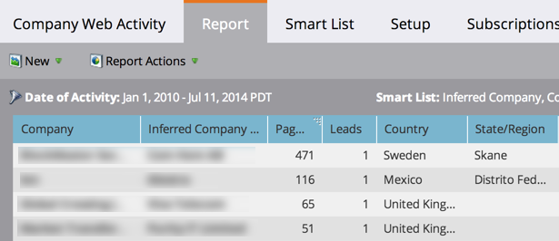

# Rapporto su attività web della società {#company-web-activity-report}

Scopri quali aziende visitano il tuo sito web. Puoi scegliere di visualizzare i visitatori noti o anonimi, ma non entrambi nello stesso rapporto.

Crea un [report attività pagina Web](/help/marketo/product-docs/reporting/basic-reporting/report-types/web-page-activity-report.md) per visualizzare le singole persone che visitano il tuo sito.

>[!PREREQUISITES]
>
>Per acquisire l&#39;attività dal sito Web in Marketo, devi prima impostare [up [!DNL Munchkin] sul sito](/help/marketo/product-docs/administration/additional-integrations/add-munchkin-tracking-code-to-your-website.md).

1. [Crea un report](/help/marketo/product-docs/reporting/basic-reporting/creating-reports/create-a-report-in-a-program.md) e seleziona il [!UICONTROL Company Web Activity] report [tipo di report](report-type-overview.md).

1. Scegli di [visualizzare persone note o anonime](/help/marketo/product-docs/reporting/basic-reporting/report-activity/display-people-or-anonymous-visitors-in-web-reports.md) nel report.

1. [Impostare l&#39;intervallo di tempo del report](/help/marketo/product-docs/reporting/basic-reporting/editing-reports/change-a-report-time-frame.md) e fare clic sulla scheda **[!UICONTROL Report]**.

1. Rivedi il rapporto per vedere quali aziende stanno visitando il tuo sito.

   

   >[!TIP]
   >
   >Per trovare le aziende che visitano maggiormente il tuo sito, [ordina il tuo report](/help/marketo/product-docs/reporting/basic-reporting/editing-reports/sort-report-on-columns.md) nella colonna _[!UICONTROL Page Views]_&#x200B;e scegli **[!UICONTROL Sort Descending]**.

   [Le colonne che puoi selezionare](/help/marketo/product-docs/reporting/basic-reporting/editing-reports/select-report-columns.md) per un report Attività Web della società includono:

<table>
 <thead>
  <tr>
   <th>Colonna/e</th>
   <th>Descrizione</th>
  </tr>
 </thead>
 <tbody>
  <tr>
   <td>Azienda</td>
   <td>Azienda dei visitatori.  <strong>I nomi in grassetto</strong> sono confermati come nome della società da almeno una persona.</td>
  </tr>
  <tr>
   <td>Società o ISP dedotto</td>
   <td>L’azienda, come dedotto dall’indirizzo IP dei visitatori.   <strong>I nomi in grassetto</strong> indicano che si tratta dell'azienda e non dell'ISP. </td>
  </tr>
  <tr>
   <td>Page Views</td>
   <td>Numero di pagine caricate dai visitatori.</td>
  </tr>
  <tr>
   <td>People</td>
   <td>Numero di persone di questa azienda che hanno visitato il tuo sito.</td>
  </tr>
  <tr>
   <td>Paese, stato/regione e città</td>
   <td>Ubicazione geografica della società.</td>
  </tr>
  <tr>
   <td>Prima/Ultima visita (fuso orario)</td>
   <td>Data e ora della prima/ultima visita da parte di un utente di questa azienda.</td>
  </tr>
 </tbody>
</table>

>[!MORELIKETHIS]
>
>[Visualizzare persone o visitatori anonimi nei report Web](/help/marketo/product-docs/reporting/basic-reporting/report-activity/display-people-or-anonymous-visitors-in-web-reports.md)
