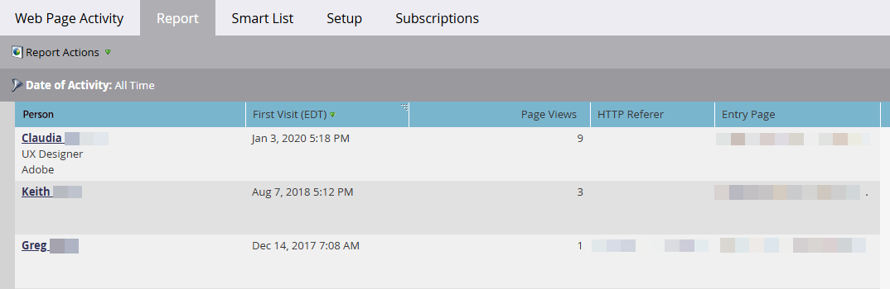

# Rapporto attività di pagina web {#web-page-activity-report}

In questo rapporto, puoi vedere chi sta visitando il tuo sito web e persino abbonarsi a una versione e-mail del rapporto.

Puoi scegliere di visualizzare nello stesso rapporto persone conosciute o anonime, ma non entrambi i tipi.

>[!PREREQUISITES]
>
>* [Aggiungi codice di tracciamento Munchkin al tuo sito Web](/help/marketo/product-docs/administration/additional-integrations/add-munchkin-tracking-code-to-your-website.md){target="_blank"}

1. [Crea un report](/help/marketo/product-docs/reporting/basic-reporting/creating-reports/create-a-report-in-a-program.md) e seleziona il **report attività pagina Web** [tipo di report](/help/marketo/product-docs/reporting/basic-reporting/report-types/report-type-overview.md){target="_blank"}
1. Scegli di [visualizzare persone note o anonime](/help/marketo/product-docs/reporting/basic-reporting/report-activity/display-people-or-anonymous-visitors-in-web-reports.md){target="_blank"} nel report.

1. [Impostare l&#39;intervallo di tempo del report](/help/marketo/product-docs/reporting/basic-reporting/editing-reports/change-a-report-time-frame.md){target="_blank"} e fare clic sulla scheda **Report**.

1. Ce l&#39;hai fatta! Rivedi il rapporto per vedere chi sta visitando il tuo sito.

   {width="800" zoomable="yes"}

   >[!NOTE]
   >
   >La visualizzazione dei dati in un report [!UICONTROL Web Page Activity] può richiedere fino a 24 ore.

   >[!TIP]
   >
   >Per scoprire chi visita di più il tuo sito, [ordina il rapporto](/help/marketo/product-docs/reporting/basic-reporting/editing-reports/sort-report-on-columns.md){target="_blank"} nella colonna _Visualizzazioni pagina_ e scegli Ordinamento decrescente.

   [Marketo aggiunge al database visitatori anonimi](/help/marketo/product-docs/reporting/basic-reporting/report-activity/tracking-anonymous-activity-and-people.md){target="_blank"} del sito Web e puoi scegliere di visualizzarli in questo report. Fornisce una grande quantità di informazioni anche se sono anonime.
   [Le colonne che è possibile selezionare](/help/marketo/product-docs/reporting/basic-reporting/editing-reports/select-report-columns.md){target="_blank"} per un report attività pagina Web includono:

<table>
 <thead>
  <tr>
   <th>Colonna/e</th>
   <th>Descrizione</th>
  </tr>
 </thead>
 <tbody>
  <tr>
   <td>Persona</td>
   <td>Il nome, il titolo e l’azienda del visitatore. <strong><a href="/help/marketo/product-docs/reporting/basic-reporting/report-types/web-page-activity-report/web-pages-viewed-web-page-activity-report.md" target="_blank">Fai clic su</a></strong> per visualizzare le pagine visitate.</td>
  </tr>
  <tr>
   <td>Prima/Ultima visita (fuso orario)</td>
   <td>Data e ora della prima/ultima visita da parte di un utente di questa azienda.</td>
  </tr>
  <tr>
   <td>Page Views</td>
   <td>Numero di pagine caricate dal visitatore.</td>
  </tr>
  <tr>
   <td>Referer HTTP</td>
   <td>URL della pagina che contiene il collegamento seguito dal visitatore alla pagina.</td>
  </tr>
  <tr>
   <td>Pagina di ingresso</td>
   <td>Prima pagina della persona visitata </td>
  </tr>
  <tr>
   <td>Società o ISP dedotto</td>
   <td>L’azienda, come dedotto dall’indirizzo IP dei visitatori. <strong>I nomi in grassetto</strong> indicano che si tratta dell'azienda e non dell'ISP. </td>
  </tr>
  <tr>
   <td>Paese, stato/regione e città dedotti</td>
   <td>Posizione geografica del visitatore, come dedotto dal suo indirizzo IP.</td>
  </tr>
 </tbody>
</table>

>[!TIP]
>
>Dai un&#39;occhiata ai tuoi rappresentanti! [Filtra il report](/help/marketo/product-docs/reporting/basic-reporting/editing-reports/filter-people-in-a-report-with-a-smart-list.md){target="_blank"} per il proprio territorio e [abbonali](/help/marketo/product-docs/reporting/basic-reporting/report-subscriptions/subscribe-to-a-basic-report.md){target="_blank"}!

>[!MORELIKETHIS]
>
>* [Pagine Web visualizzate, Report attività pagina Web](/help/marketo/product-docs/reporting/basic-reporting/report-types/web-page-activity-report/web-pages-viewed-web-page-activity-report.md){target="_blank"}
>* [Visualizzare persone o visitatori anonimi nei report Web](/help/marketo/product-docs/reporting/basic-reporting/report-activity/display-people-or-anonymous-visitors-in-web-reports.md){target="_blank"}
