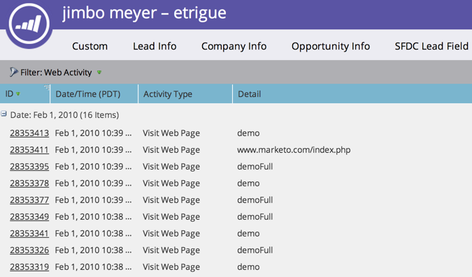

# Pagine Web visualizzate, Rapporto attività pagina Web {#web-pages-viewed-web-page-activity-report}

Da un [Rapporto attività pagina web](/help/marketo/product-docs/reporting/basic-reporting/report-types/web-page-activity-report.md), puoi visualizzare le pagine specifiche visualizzate dalle persone nel rapporto.

>[!PREREQUISITES]
>
>Per acquisire l’attività dal sito web in Marketo, devi innanzitutto  [configurare Munchkin sul sito](/help/marketo/product-docs/administration/additional-integrations/add-munchkin-tracking-code-to-your-website.md).

1. Nel tuo [Rapporto attività pagina web](/help/marketo/product-docs/reporting/basic-reporting/report-types/web-page-activity-report.md), fare clic sul numero nella colonna Visualizzazioni pagina.

   

1. Ci sei! Viene visualizzata una nuova finestra che mostra l’elenco delle pagine del sito visitate dalla persona e quando.

   

   >[!MORELIKETHIS]
   >
   >Creare un  [Rapporto Attività Web società](/help/marketo/product-docs/reporting/basic-reporting/report-types/company-web-activity-report.md) per vedere quali aziende visitano il tuo sito.
