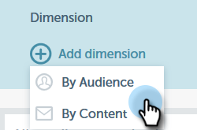

# Dimensioni personalizzate per approfondimenti e-mail {#custom-dimensions-for-email-insights}

Sono incluse tutte le dimensioni Marketo standard, ma puoi aggiungere fino a 10 dimensioni personalizzate. Le dimensioni personalizzate sono costituite da segmentazioni e tag di programma. Ecco come aggiungerli.

>[!NOTE]
>
>**Autorizzazioni amministratore richieste**

>[!CAUTION]
>
>Le dimensioni personalizzate **non possono** essere eliminate o sostituite, quindi scegli attentamente le tue 10.

1. In [!UICONTROL Email Insights] fare clic sull&#39;icona a forma di ingranaggio in alto a destra della pagina.

   

1. Fai clic su **[!UICONTROL System]**.

   

1. Fai clic su **+** accanto a **[!UICONTROL Add dimension]**.

   

1. Inizia a selezionare.

   

   >[!NOTE]
   >
   >**[!UICONTROL By Audience]**: visualizza tutte le segmentazioni approvate (dal database)
   >
   >**[!UICONTROL By Content]**: visualizza tutti i tag del programma
