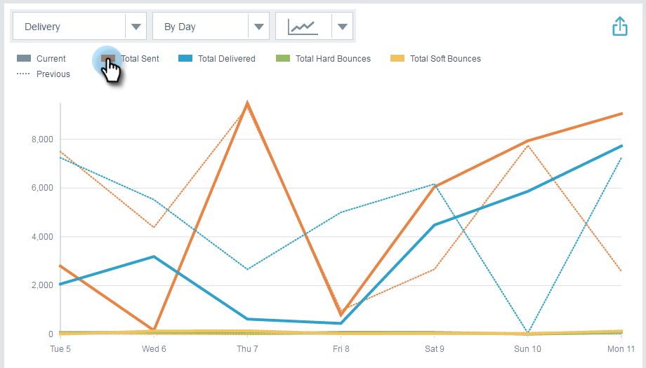
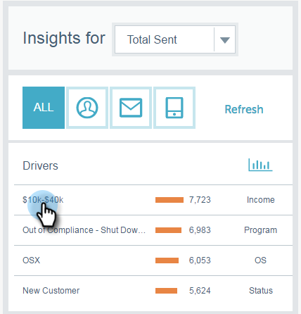

# Panoramica analisi su approfondimenti e-mail {#email-insights-analytics-overview}

In [!UICONTROL Analytics], esplora i dati aggregati per la consegna e il coinvolgimento delle e-mail. Utilizza il grafico a sinistra per esplorare i dati, mentre le informazioni a destra per un’esperienza più guidata.

[Il filtro](/help/marketo/product-docs/reporting/email-insights/filtering-in-email-insights.md) è disponibile per aiutarti a eseguire il drill-down per metriche specifiche.

Le tessere KPI (Key Points of Interest) consentono di esaminare rapidamente le metriche più comuni.

Passa il puntatore del mouse sulle tessere KPI per visualizzare i dettagli...

...oppure visualizzare i dettagli senza dover passare il cursore per espandere la finestra del browser (su schermi più grandi).

>[!TIP]
>
>Quei colori significano qualcosa! Il verde indica un cambiamento positivo, il rosso indica un cambiamento negativo, il grigio indica che nulla è cambiato. Questo si basa sul periodo di confronto scelto nel filtraggio.

Il grafico mostra i criteri filtrati. Per nascondere uno dei filtri, fai clic sulla relativa barra dei colori...

...e la metrica scompare dal grafico. Fare di nuovo clic sulla barra dei colori per visualizzarla nuovamente.

Se crei un grafico che desideri riutilizzare, impostalo come [grafico rapido](/help/marketo/product-docs/reporting/email-insights/email-insights-quick-charts.md).

Sul lato destro della pagina, le metriche guidate consentono di individuare i driver rilevanti. Fai clic su una metrica per visualizzarla nel grafico sul lato sinistro della pagina.

>[!NOTE]
>
>Vedi [!UICONTROL Refresh] in alto a destra? Quando lo visualizzi, dovrai fare clic manualmente su di esso per aggiornare il modulo Insights. Questo viene visualizzato solo se hai apportato una modifica ai filtri che invaliderebbe i valori correnti.

Puoi anche specificare cosa visualizzare (da sinistra a destra): Tutto, Pubblico, Contenuto e Piattaforma.

>[!MORELIKETHIS]
>
>[Panoramica sugli invii di Email Insights](/help/marketo/product-docs/reporting/email-insights/email-insights-sends-overview.md)
