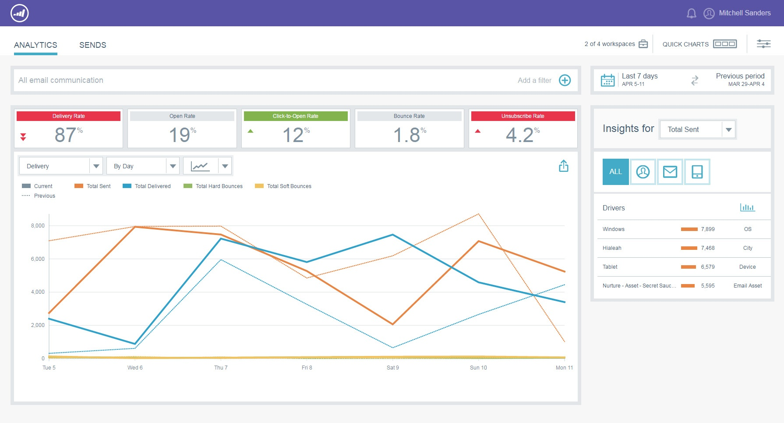
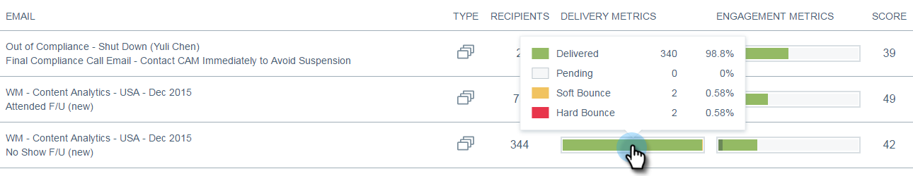

# Panoramica sulle e-mail {#email-insights-overview}

Le informazioni sulle e-mail forniscono informazioni potenti dai dati storici per gli addetti al marketing delle e-mail. È costituito da due sezioni distinte ma associate: Analytics e Send.

Per accedere a Informazioni e-mail, fai clic semplicemente sulla sezione corrispondente in My Marketo (o nella schermata principale di Analytics).

>[!NOTE]
>
>Per impostazione predefinita vengono visualizzati i dati per ogni area di lavoro a cui si ha accesso. È possibile deselezionare le aree di lavoro che non si desidera visualizzare. Le selezioni effettuate verranno memorizzate in futuro.

## Analytics {#analytics}

Utilizzate [Analytics](/help/marketo/product-docs/reporting/email-insights/email-insights-analytics-overview.md) per esplorare i dati aggregati delle serie temporali per la distribuzione delle e-mail e le metriche di coinvolgimento.

**Filtri**

Sono stati utilizzati filtri [avanzati](/help/marketo/product-docs/reporting/email-insights/filtering-in-email-insights.md) per suddividere i risultati per pubblico, contenuto o piattaforma. Gli stessi filtri si applicano sia ad Analytics che a Sending.

**Grafici rapidi**

[I ](/help/marketo/product-docs/reporting/email-insights/email-insights-quick-charts.md) grafici rapidi sono miniature che potete creare e salvare e forniscono una rapida visualizzazione dei grafici che sono importanti per voi.

## Invia {#sends}

Nella pagina [Invia](/help/marketo/product-docs/reporting/email-insights/email-insights-sends-overview.md), esamina le caratteristiche della comunicazione e-mail recente.

**Metriche**

Fate clic sulle barre Metriche per tradurre i colori in numeri.

>[!NOTE]
>
>Potrebbero essere necessarie fino a 8 ore per riflettere i dati nelle informazioni sulle e-mail.

## Dimension personalizzati {#custom-dimensions}

Sono incluse tutte le dimensioni standard di Marketo, ma è possibile aggiungere fino a 10 dimensioni personalizzate. [La ](/help/marketo/product-docs/reporting/email-insights/custom-dimensions-for-email-insights.md) dimensione personalizzata è costituita da segmentazioni e tag di programma.

>[!MORELIKETHIS]
>
>* [Panoramica sull&#39;analisi degli approfondimenti e-mail](/help/marketo/product-docs/reporting/email-insights/email-insights-analytics-overview.md)
>* [Panoramica sulle e-mail Insights](/help/marketo/product-docs/reporting/email-insights/email-insights-sends-overview.md)

