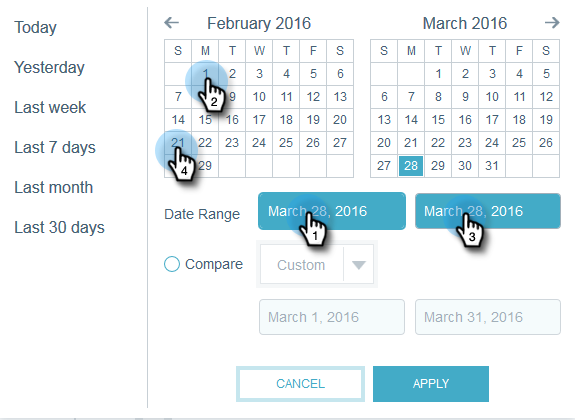

# Approfondimenti e-mail Grafici rapidi {#email-insights-quick-charts}

I grafici rapidi sono miniature personalizzate e salvate, per una rapida visualizzazione dei grafici più utilizzati.

## Creare un nuovo grafico rapido {#create-a-new-quick-chart}

In questo esempio, sceglieremo il tasso aperto per le prime tre settimane di febbraio 2016, negli stati della California e della Florida.

1. Fate clic sul filtro della data a destra della schermata Analisi.

   

1. Scegliete l’intervallo di date desiderato.

   

1. Quando l&#39;intervallo di date è selezionato, fare clic su **Applica**.

   

1. Il grafico cambia dopo l’applicazione delle date.

   

1. Fare clic sul primo elenco a discesa. Fate clic per selezionare il criterio (se non è già selezionato) e deselezionate eventuali criteri indesiderati.

   

1. Sul lato destro del grafico, fare clic sull&#39;icona di esportazione e selezionare **Salva come grafico rapido**.

   

1. Assegnate un nome al grafico rapido e fate clic su **Salva**.

   

   >[!NOTE]
   >
   >È possibile avere fino a 20 grafici rapidi. Possono essere eliminati e sostituiti.

1. Il nuovo grafico rapido verrà visualizzato insieme agli altri.

   

   Ed è tutto!

   >[!TIP]
   >
   >Per spostare un grafico rapido, è sufficiente fare clic e trascinarlo nella posizione desiderata.

## Eliminare un grafico rapido {#delete-a-quick-chart}

Vuoi eliminare uno dei tuoi grafici rapidi? È facile!

1. Fare clic sull&#39;icona **Quick Charts**.

   

1. Passa il cursore del mouse sul grafico desiderato, ma non fai clic su di esso. Al passaggio del mouse, verrà visualizzata una X. Fare clic su **X**.

   

1. Fare clic su **Ok**.

   

   Il grafico rapido è stato eliminato. Gliel&#39;ho detto che era facile.
