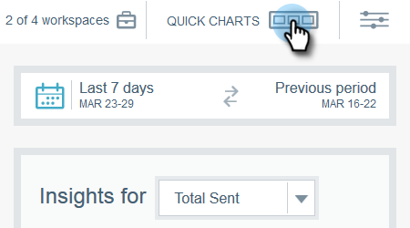

# Grafici rapidi di Email Insights {#email-insights-quick-charts}

I grafici rapidi sono miniature personalizzate e salvate, che consentono di visualizzare rapidamente i grafici più utilizzati.

## Crea un nuovo grafico rapido {#create-a-new-quick-chart}

In questo esempio, sceglieremo open rate per le prime tre settimane di febbraio 2016, negli stati della California e della Florida.

1. Fai clic sul filtro della data a destra della schermata Analytics.

   

1. Scegli l’intervallo di date desiderato.

   

1. Quando l’intervallo di date è selezionato, fai clic su **Applica**.

   

1. Il grafico cambia dopo l’applicazione delle date.

   

1. Fai clic sul primo elenco a discesa. Fai clic su per selezionare i criteri (se non sono già selezionati) e deseleziona eventuali criteri indesiderati.

   

1. Sul lato destro del grafico, fai clic sull’icona Esporta e seleziona **Salva come grafico rapido**.

   

1. Assegna un nome al grafico rapido e fai clic su **Salva**.

   

   >[!NOTE]
   >
   >Puoi avere fino a 20 grafici rapidi. Possono essere eliminati e sostituiti.

1. Il nuovo grafico rapido verrà visualizzato con gli altri.

   

   Ed è tutto!

   >[!TIP]
   >
   >Per spostare un grafico rapido, è sufficiente fare clic e trascinarlo nella posizione desiderata.

## Eliminare un grafico rapido {#delete-a-quick-chart}

Eliminare uno dei grafici rapidi? È facile!

1. Fai clic su **Grafici rapidi** icona.

   

1. Passa il cursore del mouse sul grafico desiderato, ma non fai clic su di esso. Al passaggio del mouse, viene visualizzata una X. Fai clic su **X**.

   

1. Clic **Ok**.

   

   Il grafico rapido è stato eliminato. Te l&#39;avevo detto che era facile.
