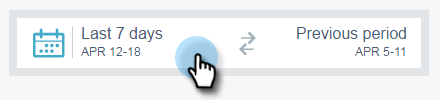

# Filtraggio in Informazioni e-mail {#filtering-in-email-insights}

In Email Insights (Approfondimenti e-mail) sono disponibili diversi modi per filtrare i dati.

## Email Insights {#email-insights}

Fai clic sul pulsante + per iniziare ad aggiungere filtri. Aggiungetene quanti ne volete.

Se nella stessa categoria sono presenti più filtri, questi eseguiranno l&#39;unione e visualizzeranno la quantità.

Se hai bisogno di vedere quali filtri hai applicato, fai clic sul filtro. Puoi anche aggiungerne altre.

Puoi anche aggiungere altri tipi di filtri.

E ancora più filtri!

Il grafico cambia dopo l’applicazione di ciascun filtro.

Per eliminare una categoria, fare clic sulla X corrispondente.

Per cancellare tutti i filtri, fai clic sulla X alla fine della barra dei filtri.

Per dati specifici per data, utilizza intervalli di date.

Scegli tra intervalli di date predefiniti comuni, seleziona date specifiche e utilizza il periodo precedente per il confronto.

>[!NOTE]
>
>Gli intervalli di date si applicano sia alla pagina Analytics che alla pagina Invii. Il **Confronta** Tuttavia, questa opzione è applicabile solo alla pagina Analytics.

## Marketing basato sull&#39;account {#account-based-marketing}

Se usa [Gestione account di destinazione](https://docs.marketo.com/display/DOCS/Account+Based+Marketing+Overview), esistono filtri specifici per te.

