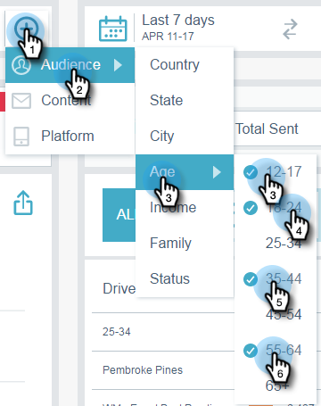

# Filtraggio in Approfondimenti e-mail {#filtering-in-email-insights}

In Approfondimenti e-mail, esistono diversi modi per filtrare i dati.

## Approfondimenti e-mail {#email-insights}

Fai clic sul segno + per iniziare ad aggiungere filtri. Aggiungete quanti ne volete.

Se nella stessa categoria sono presenti più filtri, questi verranno uniti e visualizzati la quantità.

Per visualizzare i filtri applicati, fai clic sul filtro. Puoi anche aggiungerne altri lì.

Puoi anche aggiungere altri tipi di filtri.

E ancora più filtri!

Il grafico cambia dopo ogni filtro applicato.

Per eliminare una categoria, fare clic sulla relativa X.

Per cancellare tutti i filtri, fai clic sulla X alla fine della barra del filtro.

Per dati specifici per data, utilizza intervalli di date.

Scegli tra intervalli di date predefiniti comuni, seleziona date specifiche e utilizza anche il periodo precedente per il confronto.

>[!NOTE]
>
>Gli intervalli di date si applicano sia alla pagina Analytics che alla pagina Invio. La **Confronto** tuttavia, questa opzione è applicabile solo alla pagina Analytics.

## Marketing basato su account {#account-based-marketing}

Se utilizzi [Gestione account di Target](https://docs.marketo.com/display/DOCS/Account+Based+Marketing+Overview), esistono filtri specifici per te.

