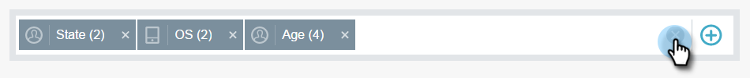

# Filtro in [!UICONTROL Email Insights] {#filtering-in-email-insights}

In [!UICONTROL Email Insights] esistono diversi modi per filtrare i dati.

## [!UICONTROL Email Insights] {#email-insights}

Fai clic sul pulsante + per iniziare ad aggiungere filtri. Aggiungetene quanti ne volete.

Se nella stessa categoria sono presenti più filtri, questi eseguiranno l&#39;unione e visualizzeranno la quantità.

Se hai bisogno di vedere quali filtri hai applicato, fai clic sul filtro. Puoi anche aggiungerne altre.

Puoi anche aggiungere altri tipi di filtri.

E ancora più filtri!

Il grafico cambia dopo l’applicazione di ciascun filtro.

Per eliminare una categoria, fare clic sulla X corrispondente.

Per cancellare tutti i filtri, fai clic sulla X alla fine della barra dei filtri.

Per dati specifici per data, utilizza intervalli di date.

Scegli tra intervalli di date predefiniti comuni, seleziona date specifiche e utilizza il periodo precedente per il confronto.

>[!NOTE]
>
>Gli intervalli di date si applicano sia alla pagina [!UICONTROL Analytics] che alla pagina [!UICONTROL Sends]. L&#39;opzione **Confronta** è tuttavia applicabile solo alla pagina [!UICONTROL Analytics].

## Marketing basato sull&#39;account {#account-based-marketing}

Se utilizzi [[!UICONTROL Target Account Management]](https://docs.marketo.com/display/DOCS/Account+Based+Marketing+Overview), sono presenti filtri specifici per te.

