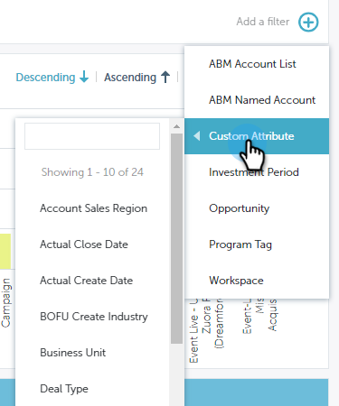
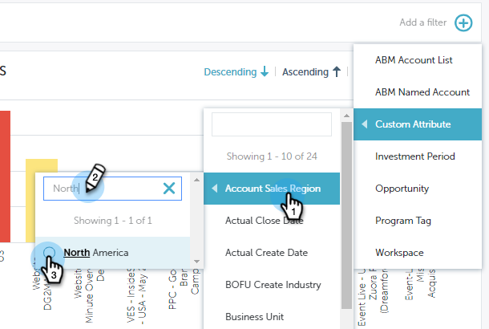

# Filtraggio in Performance Insights {#filtering-in-performance-insights}

Filtrare facilmente i dati per eseguire query su informazioni specifiche.

Fai clic sul segno + per iniziare ad aggiungere filtri.

>[!NOTE]
>
>Al momento, gli attributi personalizzati sono disponibili nei filtri solo per i clienti che hanno abilitato l’analisi del ciclo dei ricavi.

Facendo clic su una categoria vengono visualizzate più sottocategorie.

Scegli una sottocategoria e cerca/seleziona un valore.

I grafici vengono aggiornati in modo da riflettere i filtri selezionati.

Puoi aggiungere altri filtri seguendo gli stessi passaggi.

Puoi rimuovere un filtro in qualsiasi momento facendo clic sulla X accanto ad esso. Rimuovi tutti i filtri contemporaneamente facendo clic sulla X all&#39;estrema destra.

## Filtri disponibili {#available-filters}

<table> 
 <tbody> 
  <tr> 
   <td colspan="1"><strong>Elenco account ABM</strong></td> 
   <td colspan="1">Se utilizzi Marketo ABM, tutti gli elenchi dei tuoi account verranno sincronizzati in MPI e saranno visibili tramite il filtro "ABM Account List". È possibile selezionare un elenco di account per filtrare i risultati in tali account.<a href="https://docs.marketo.com/display/public/DOCS/Account-Based+Web+Marketing+with+ABM" rel="nofollow">Ulteriori informazioni sugli elenchi di account ABM.</a></td> 
  </tr> 
  <tr> 
   <td colspan="1"><strong>Account con nome ABM</strong></td> 
   <td colspan="1">Se utilizzi Marketo ABM, tutti i tuoi account denominati verranno sincronizzati in MPI e saranno visibili tramite il filtro "ABM Named Account". Puoi selezionare un account con nome per filtrare i risultati in tali account.<a href="https://docs.marketo.com/x/eaCt" rel="nofollow">Ulteriori informazioni sugli account con nome ABM.</a></td> 
  </tr> 
  <tr> 
   <td colspan="1"><strong>Attributi personalizzati</strong></td> 
   <td colspan="1">
Questi sono determinati da te. Tutti i campi <a href="/help/marketo/product-docs/reporting/revenue-cycle-analytics/revenue-tools/enabling-custom-field-sync-for-revenue-cycle-analytics.md" rel="nofollow">abilita</a> per l’analisi delle opportunità può essere filtrata in Performance Insights.
</td> 
  </tr> 
  <tr> 
   <td colspan="1">
<strong>Periodo di investimento</strong>
</td> 
   <td colspan="1">
Tempi di esecuzione dei programmi.
</td> 
  </tr> 
  <tr> 
   <td colspan="1">
<strong>Tipo di opportunità</strong>
</td> 
   <td colspan="1">
Tipo di opportunità impostato sull'oggetto Opportunity nella configurazione di Salesforce (CRM).
</td> 
  </tr> 
  <tr> 
   <td>
<strong>Tag del programma</strong>
</td> 
   <td>
I tag vengono utilizzati per descrivere i programmi. Puoi crearne quanti ne desideri, ciascuno con valori univoci. <a href="/help/marketo/product-docs/administration/tags/create-a-new-program-tag-and-tag-values.md" rel="nofollow">Scopri come utilizzare i tag dei programmi qui.</a>
</td> 
  </tr> 
  <tr> 
   <td><strong>Area di lavoro</strong></td> 
   <td>
Le aree di lavoro sono aree separate in Marketo che contengono risorse di marketing, come: programmi, pagine di destinazione, e-mail e altro ancora. <a href="/help/marketo/product-docs/administration/workspaces-and-person-partitions/understanding-workspaces-and-person-partitions.md" rel="nofollow">Ulteriori informazioni sulle aree di lavoro disponibili qui.</a>
</td> 
  </tr> 
 </tbody> 
</table>

>[!NOTE]
>
>Nel dashboard Coinvolgimento sono disponibili solo i tag del programma e i filtri dell’area di lavoro.
