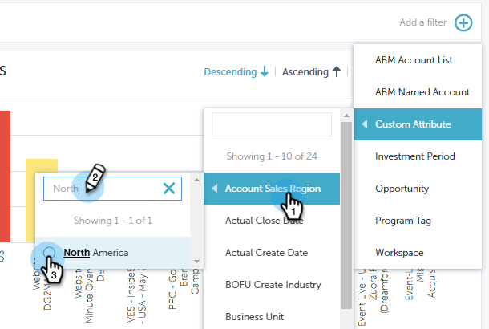
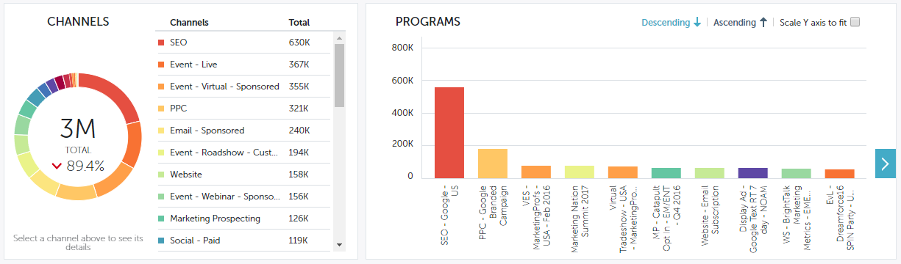

# Filtro in [!UICONTROL Performance Insights] {#filtering-in-performance-insights}

Filtra facilmente i dati per eseguire query su informazioni specifiche.

Fai clic sul pulsante + per iniziare ad aggiungere filtri.

>[!NOTE]
>
>Al momento, gli attributi personalizzati sono disponibili nei filtri solo per i clienti che hanno Revenue Cycle Analytics abilitato.

Facendo clic su una categoria vengono visualizzate più sottocategorie.

Scegli una sottocategoria e cerca/seleziona un valore.

I grafici vengono aggiornati in base ai filtri selezionati.

Per aggiungere altri filtri, segui la stessa procedura.

Puoi rimuovere un filtro in qualsiasi momento facendo clic sulla X accanto a esso. Per rimuovere tutti i filtri contemporaneamente, fai clic sulla X all’estrema destra.

## Filtri disponibili {#available-filters}

<table>
 <tbody>
  <tr>
   <td colspan="1"><strong>Elenco account ABM</strong></td>
   <td colspan="1">Se utilizzi Marketo ABM, tutti gli elenchi di account verranno sincronizzati in MPI e saranno visibili tramite il filtro "Elenco account ABM". Puoi selezionare un elenco di account per filtrare i risultati in base a tali account.<a href="https://docs.marketo.com/display/public/DOCS/Account-Based+Web+Marketing+with+ABM" rel="nofollow">Ulteriori informazioni sugli elenchi di account ABM.</a></td>
  </tr>
  <tr>
   <td colspan="1"><strong>Account denominato ABM</strong></td>
   <td colspan="1">Se utilizzi Marketo ABM, tutti gli account denominati verranno sincronizzati in MPI e saranno visibili tramite il filtro 'Account denominato ABM'. Puoi selezionare un account denominato per filtrare i risultati in base a tali account.<a href="https://docs.marketo.com/x/eaCt" rel="nofollow">Ulteriori informazioni sugli account denominati ABM.</a></td>
  </tr>
  <tr>
   <td colspan="1">
<strong>Periodo di investimento</strong>
</td>
   <td colspan="1">
Intervallo temporale dei costi del programma.
</td>
  </tr>
  <tr>
   <td colspan="1">
<strong>Opportunità</strong>
</td>
   <td colspan="1">
Tipo di opportunità impostato sull’oggetto Opportunità nella configurazione di Salesforce (CRM).
</td>
  </tr>
  <tr>
   <td>
<strong>Tag del programma</strong>
</td>
   <td>
I tag vengono utilizzati per descrivere i programmi. Puoi crearne quanti ne hai bisogno, ciascuno con valori univoci. <a href="/help/marketo/product-docs/administration/tags/create-a-new-program-tag-and-tag-values.md" rel="nofollow">Scopri come utilizzare i tag del programma qui.</a>
</td>
  </tr>
  <tr>
   <td><strong>Area di lavoro</strong></td>
   <td>
Le aree di lavoro sono aree separate in Marketo che contengono risorse di marketing, ad esempio programmi, pagine di destinazione, e-mail e altro ancora. <a href="/help/marketo/product-docs/administration/workspaces-and-person-partitions/understanding-workspaces-and-person-partitions.md" rel="nofollow">Ulteriori informazioni sulle aree di lavoro qui.</a>
</td>
  </tr>
 </tbody>
</table>

>[!NOTE]
>
>Nel dashboard [!UICONTROL Engagement] sono disponibili solo i tag del programma e i filtri dell&#39;area di lavoro.
