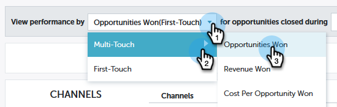
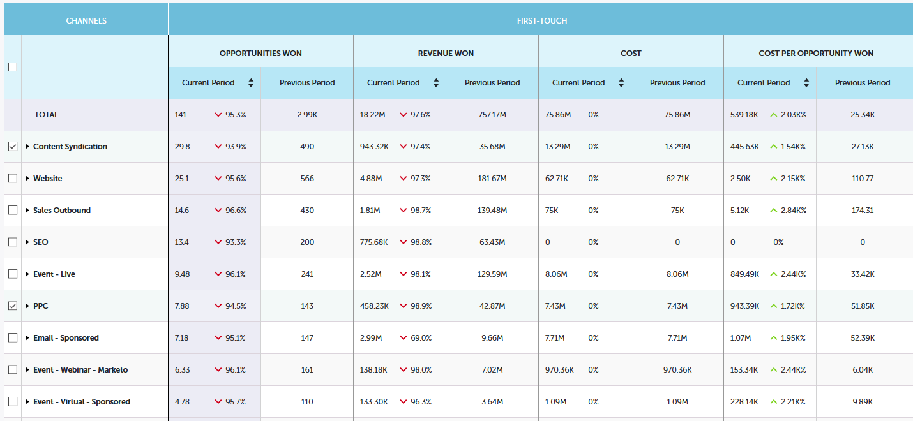

# Panoramica del contributo di Performance Insights {#performance-insights-contribution-overview}

In Approfondimenti prestazioni Marketo, per impostazione predefinita viene visualizzata la vista Contributo.

Seleziona la metrica in base alla quale visualizzare le prestazioni. In questo esempio esamineremo le opportunità realizzate tramite Multi-Touch nel dashboard Ricavi.

>[!NOTE]
>
>Informazioni su [Primo contatto e multi-contatto](/help/marketo/product-docs/reporting/revenue-cycle-analytics/revenue-tools/attribution/understanding-attribution.md).

Scegli il periodo per il quale visualizzare le metriche. In questo esempio viene illustrato l’anno corrente (progressivo anno).

>[!NOTE]
>
>La selezione &quot;Anno precedente&quot; è stata temporaneamente rimossa. Puoi comunque visualizzare tutti i dati sulle prestazioni dell’anno precedente utilizzando la selezione Intervallo personalizzato.

Le metriche sono presentate tramite due grafici: ciambella e barra.

Il grafico ad anello mostra i primi dieci canali per la metrica selezionata.

Il grafico a barre mostra le prestazioni del programma su tutti i canali (dieci programmi alla volta) per la metrica selezionata. Per ulteriori informazioni, fare clic sulla freccia a destra per scorrere fino al gruppo successivo.

>[!TIP]
>
>Se desiderate che le barre del grafico aumentino durante lo scorrimento dei gruppi, selezionate **Adatta asse Y** casella di controllo.

Passa il puntatore del mouse su una barra per visualizzare ulteriori dettagli.

Selezionare uno o più canali nel grafico ad anello e tutti i programmi associati a tali canali vengono visualizzati nel grafico a barre a destra. Fai di nuovo clic sui canali per deselezionare.

La griglia dati seguente funziona come un foglio di calcolo e mostra tutte le metriche disponibili nel modello di attribuzione scelto (First-Touch/Multi-Touch). Viene evidenziata la colonna contenente la metrica scelta.

| **Opportunità acquisite** | La parte di credito (in valore numerico) ricevuta dal programma per influenzare l’opportunità acquisita |
|---|---|
| **Ricavi ottenuti** | La parte di credito (in valore monetario) ricevuta dal programma per influenzare l’opportunità acquisita |
| **Costo** | Costo totale del programma |
| **Costo per opportunità acquisita** | Il rapporto tra il costo del programma e la parte di credito (in valore numerico) ricevuta dal programma per influenzare la creazione di nuove opportunità |
| **Rapporto ricavi acquisiti/costi** | Il rapporto tra la parte di credito (in valore monetario) ricevuta dal programma per influenzare le opportunità realizzate e il costo del programma |

Espandere un canale per visualizzare i suoi dieci programmi principali, con i programmi rimanenti combinati.

>[!NOTE]
>
>Fai clic sulla casella di controllo accanto a un canale per attivarlo/disattivarlo nel grafico ad anello riportato sopra.
