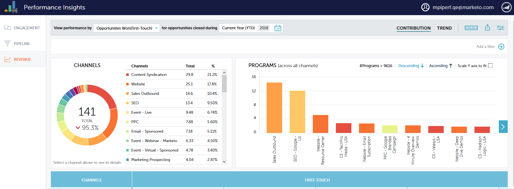
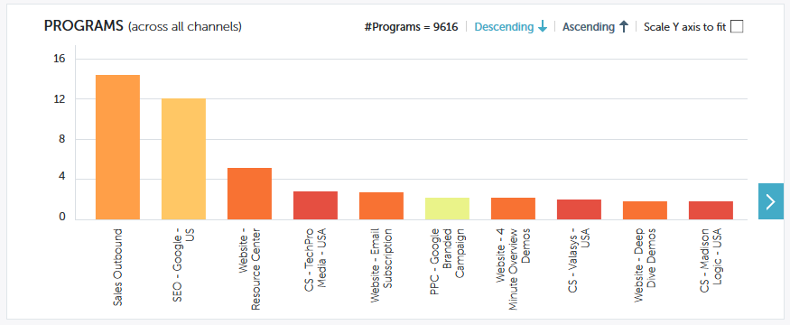
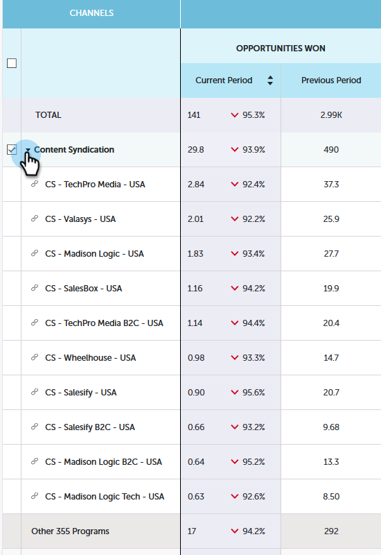

# Panoramica del contributo [!UICONTROL Performance Insights] {#performance-insights-contribution-overview}

In Marketo [!UICONTROL Performance Insights], la visualizzazione Contributo viene visualizzata per impostazione predefinita.

Seleziona la metrica in base alla quale visualizzare le prestazioni. In questo esempio verranno esaminate le opportunità realizzate tramite **[!UICONTROL Multi-Touch]** nel dashboard _[!UICONTROL Revenue]_.

Scegli il periodo per il quale visualizzare le metriche. In questo esempio viene illustrato l’anno corrente (progressivo anno).

>[!NOTE]
>
>La selezione &quot;Anno precedente&quot; è stata temporaneamente rimossa. È comunque possibile visualizzare tutti i dati sulle prestazioni dell&#39;anno precedente utilizzando la selezione **[!UICONTROL Custom Range]**.

Le metriche sono presentate tramite due grafici: ciambella e barra.

Il grafico ad anello mostra i primi dieci canali per la metrica selezionata.

Il grafico a barre mostra le prestazioni del programma su tutti i canali (dieci programmi alla volta) per la metrica selezionata. Per ulteriori informazioni, fare clic sulla freccia a destra per scorrere fino al gruppo successivo.

>[!TIP]
>
>Se si desidera che le barre del grafico aumentino durante lo scorrimento dei gruppi, selezionare la casella di controllo **[!UICONTROL Scale Y axis to fit]**.

Passa il puntatore del mouse su una barra per visualizzare ulteriori dettagli.

Selezionare uno o più canali nel grafico ad anello e tutti i programmi associati a tali canali vengono visualizzati nel grafico a barre a destra. Fai di nuovo clic sui canali per deselezionare.

La griglia dati seguente funziona come un foglio di calcolo, mostrando tutte le metriche disponibili nel modello di attribuzione scelto ([!UICONTROL First-Touch]/[!UICONTROL Multi-Touch]). Viene evidenziata la colonna contenente la metrica scelta.

| **[!UICONTROL Opportunities Won]** | La parte di credito (in valore numerico) ricevuta dal programma per influenzare l’opportunità acquisita |
|---|---|
| **[!UICONTROL Revenue Won]** | La parte di credito (in valore monetario) ricevuta dal programma per influenzare l’opportunità acquisita |
| **[!UICONTROL Cost]** | Costo totale del programma |
| **[!UICONTROL Cost Per Opportunity Won]** | Il rapporto tra il costo del programma e la parte di credito (in valore numerico) ricevuta dal programma per influenzare la creazione di nuove opportunità |
| **[!UICONTROL Revenue Won To Cost Ratio]** | Il rapporto tra la parte di credito (in valore monetario) ricevuta dal programma per influenzare le opportunità realizzate e il costo del programma |

Espandere un canale per visualizzare i suoi dieci programmi principali, con i programmi rimanenti combinati.

>[!NOTE]
>
>Fai clic sulla casella di controllo accanto a un canale per attivarlo/disattivarlo nel grafico ad anello riportato sopra.
