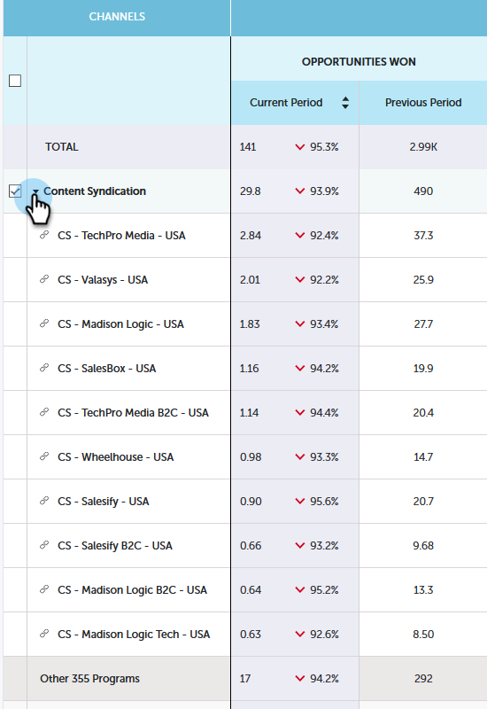

# Panoramica del contributo di Performance Insights {#performance-insights-contribution-overview}

In Marketo Performance Insights, la visualizzazione Contribution viene visualizzata per impostazione predefinita.

Seleziona la metrica in base alla quale desideri visualizzare le prestazioni. In questo esempio esamineremo le opportunità vinte tramite Multi-Touch nel dashboard Entrate.

>[!NOTE]
>
>Scopri [Primo contatto e multi-touch](/help/marketo/product-docs/reporting/revenue-cycle-analytics/revenue-tools/attribution/understanding-attribution.md).

Scegli il periodo per il quale visualizzare le metriche. In questo esempio osserviamo l’anno corrente (anno-to-date).

>[!NOTE]
>
>Abbiamo temporaneamente rimosso la selezione &quot;Anno precedente&quot;. Puoi comunque visualizzare i dati delle prestazioni dell’anno precedente per intero, utilizzando la selezione Intervallo personalizzato.

Le metriche sono presentate tramite due grafici: ciambella e barra.

Il grafico ad anello mostra i dieci canali principali per la metrica selezionata.

Il grafico a barre mostra le prestazioni del programma in tutti i canali (dieci programmi alla volta) per la metrica selezionata. Per visualizzare di più, fai clic sulla freccia a destra per scorrere fino al gruppo successivo.

>[!TIP]
>
>Se desideri che le barre del grafico si ridimensionino durante lo scorrimento tra i gruppi, seleziona la **Adatta l&#39;asse Y** casella di controllo.

Passa il puntatore del mouse su una barra per visualizzare ulteriori dettagli.

Selezionare uno o più canali nel grafico ad anello e tutti i programmi associati a tali canali vengono visualizzati nel grafico a barre a destra. Fai nuovamente clic sui canali per deselezionare.

La griglia di dati sottostante funziona come un foglio di calcolo, mostrando tutte le metriche disponibili nel modello di attribuzione scelto (First-Touch/Multi-Touch). Viene evidenziata la colonna contenente la metrica scelta.

| **Opportunità conquistate** | La parte di credito (in valore numerico) ricevuta dal programma per influenzare l&#39;opportunità di acquisto |
|---|---|
| **Entrate vinte** | La parte di credito (in valore monetario) ricevuta dal programma per influenzare l&#39;opportunità |
| **Costo** | Costo totale del programma |
| **Costo per opportunità** | Il rapporto tra il costo del programma e la parte di credito (in valore numerico) ricevuta dal programma per influenzare la creazione di nuove opportunità |
| **Rapporto Ricavo-Costo** | Il rapporto tra la parte di credito (in valore monetario) ricevuta dal programma per influenzare le proprie opportunità e il costo del programma |

Espandi un canale per visualizzare i primi dieci programmi, combinando i restanti programmi.

>[!NOTE]
>
>Facendo clic sulla casella di controllo accanto a un canale, questo viene attivato/disattivato nel grafico a ciambelle sopra riportato.
